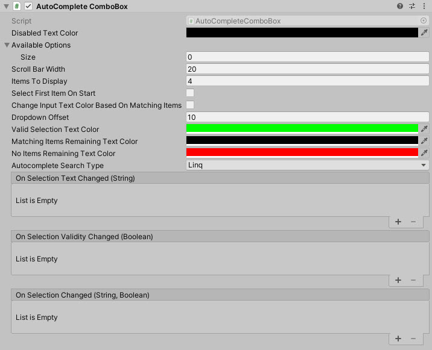

# AutoComplete ComboBox

A text combobox with autocomplete selection

<!---->

---------

## Contents

> 1 [Overview](#overview)
>
> 2 [Properties](#properties)
>
> 3 [Methods](#methods)
>
> 4 [Usage](#usage)
>
> 5 [Video Demo](#video-demo)
>
> 6 [See also](#see-also)
>
> 7 [Credits and Donation](#credits-and-donation)
>
> 8 [External links](#external-links)

---------

## Overview

A specialised text field that allows a vocabulary to be added to guide or restrict entry.

---------

## Properties

The properties of the Box Slider control are as follows:

Property | Description
|-|-|
*Disabled Text Color*|Color of the Autocomplete field when the control is disabled
*Available Options*|Array of text based options for the dropdown/selection
*Scroll Bar Width*|The width of the scrollbar when displayed
*Items To Display*|Number of child items to display when opened. *Note default 0 shows NO items.
*Select First Item On Start*|Should the first item be auto selected on start
*Change Input Text based on Matching items*|Apply the below colors to the AutoComplete field based on user typing
*Dropdown Offset*|Offset height for the drop down window, to give enough space for items
*Valid Selection Text Color*|Color of the AutoComplete text if the full text appears in the list of options
*Matching Items Remaining Text Color*|Intermediate color of text when options contain the text entered
*No Items Remaining Text Color*|Text Color when the text entered does not match anything in the list
*Autocomplete Search Type)|Selects the search method for which to validate the panel items. Values Linq, Array Sort.  Choose whichever performs best for your project.
*On Selection Text Changed* (event) |The Event fired when the the user is typing
*On Selection Validity Changed* (event) |The Event fired when the the text the user enters matches a selection
*On Selection Changed* (event) |The Event fired when the user selects an option or loses focus

> When managing the control programmatically, make sure you use the following functions to manage the ComboBox contents. **Do NOT update the 'AvailableOptions' list directly**

---------

## Methods

Method | Arguments | Description
|-|-|-|
AddItem|String|Adds a single item to the list
RemoveItem|String|Removes a single item from the list
SetAvailableOptions|List of String|Clears the current options and replaces with new list (array or List)
SetAvailableOptions|Array of String|Clears the current options and replaces with new list (array or List)
ResetItems|None|Clears all current options

---------

## Usage

Add the AutoComplete ComboBox control to your scene using:
GameObject -> UI -> Extensions -> AutoCompleteComboBox

---------

## Video Demo

---------

## See also

[ComboBox](/Controls.md/ComboBox)
[DropDownList](/Controls.md/DropDownList)

---------

## Credits and Donation

Perchik

---------

## External links

[Sourced from](http://forum.unity3d.com/threads/receive-onclick-event-and-pass-it-on-to-lower-ui-elements.293642/)
