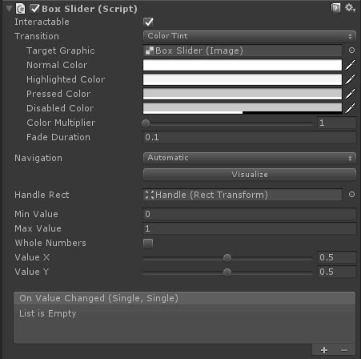
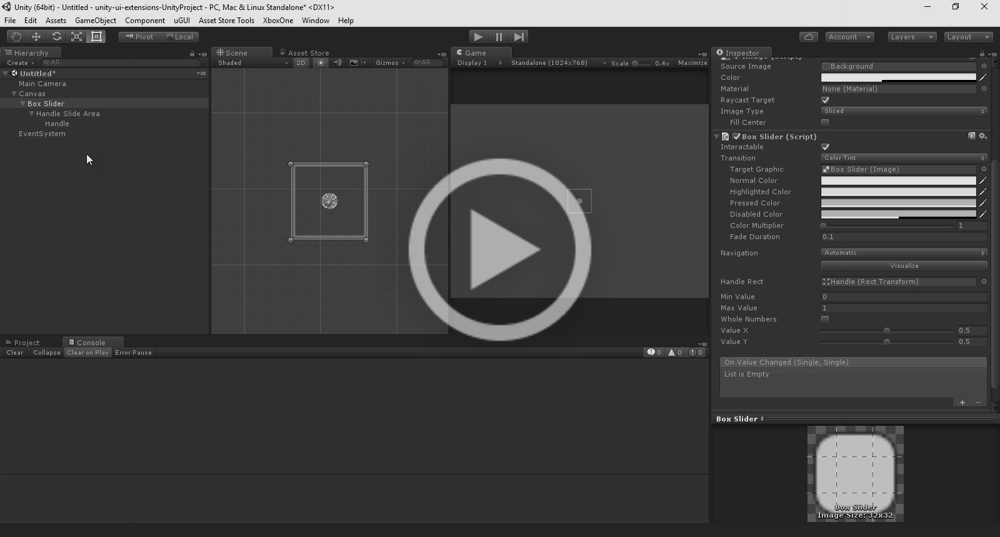

# Box Slider

A slider which supports both X and Y values within a box

<!---->

---------

## Contents

> 1 [Overview](#overview)
>
> 2 [Properties](#properties)
>
> 3 [Methods](#methods)
>
> 4 [Usage](#usage)
>
> 5 [Video Demo](#video-demo)
>
> 6 [See also](#see-also)
>
> 7 [Credits and Donation](#credits-and-donation)
>
> 8 [External links](#external-links)

---------

## Overview

The Box Slider (like the Unity Slider controls), allows you to set a value using a handle within the RectTransform of the control.
However, it supports both the X and Y axis within the area.

It allows you to set a minimum and maximum value for the axis as well as separate X and Y value selectors.

Like the Slider, it also includes an OnValueChanged event which updates as the handle is moved by the user.

---------

## Properties

The properties of the Box Slider control are as follows:

Property | Description
|-|-|
*Handle Rect*|The Rect Transform of the child handle, position used to derive values for control
*Min Value*|The minimum value for the sliders
*Max Value*|The maximum value for the sliders
*Whole Numbers*|Only use whole numbers instead of floats
*Value X*|The X value of the slider
*Value Y*|The Y value of the slider
*On Value Changed* (event) |The Event fired when the handle within the box slider is changed

### Inherited from Slider

* Interactable
* Transition
* Navigation

---------

## Usage

Simply add the default BoxSlider to the scene using "*UI / Extensions / Box Slider*" in the Editor "*GameObject*" menu.

It is also available as a Game Component menu in "*UI / Extensions / Box Slider*". However, you will need to manually set the *Handle* reference.

---------

## Video Demo

### Click to play

---------

## See also

* Unity (built-in) Slider

Also, check out the ColorSlider which implements this control

---------

## Credits and Donation

Credit [judah4](https://forum.unity3d.com/members/judah4.34568/)

---------

## External links

Sourced from - [http://forum.unity3d.com/threads/color-picker.267043/](http://forum.unity3d.com/threads/color-picker.267043/)
