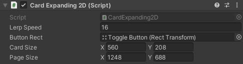
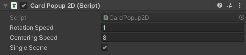
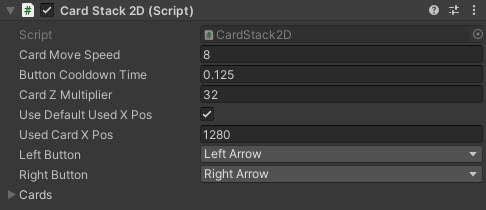
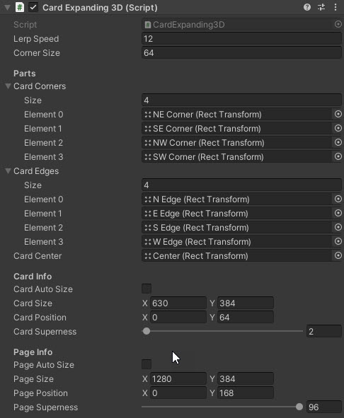
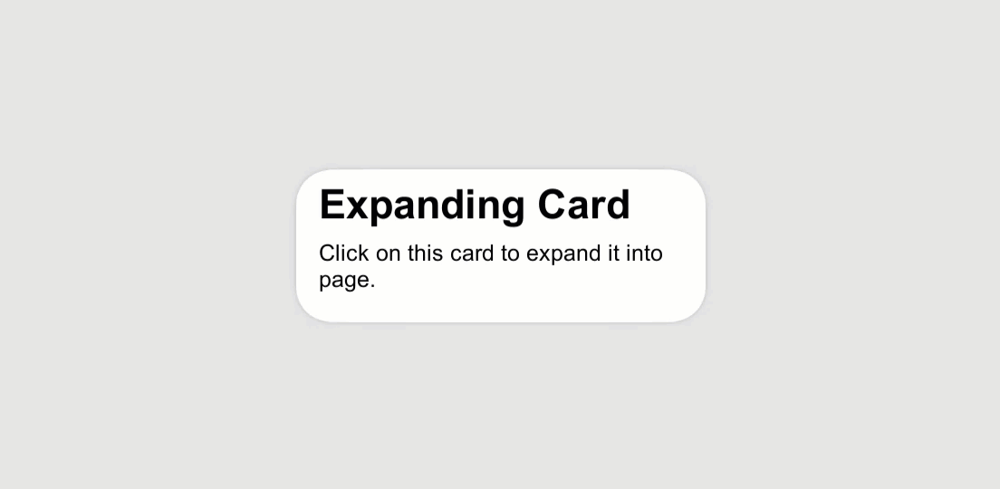

# Card UI

A range of controls to provide a Card based interface, this includes several capabilities and features to manipulate the cards based on requirements, including:

* 2D Expanding cards
* 2D Popup, including falling cards
* 2D card stacks
* 3D Expanding cards and Superelipses

<!---->

---------

## Contents

> 1 [Overview](#overview)
>
> 2 [Properties](#properties)
>
> 3 [Methods](#methods)
>
> 4 [Usage](#usage)
>
> 5 [Video Demo](#video-demo)
>
> 6 [See also](#see-also)
>
> 7 [Credits and Donation](#credits-and-donation)
>
> 8 [External links](#external-links)

---------

## Overview

The range of Card UI controls give you several options for creating card like UI elements for your project.

* 2D Expanding Card - A clickable/expandable card layout.
* 2D Popup - Physics enabled falling cards.
* 2D Stacked cards - A depth orientated controller for displaying cards stacked on top of each other.
* 3D Cards - Custom panel meshes with rounded corners for advanced effect.

|2D Card Expanding|2D Popup Cards
|---|---|
||

|2D Stacked Cards|3D Expanding Cards
|---|---|
||

---------

## Properties

The Card UI suite includes several prefabs and behaviours. Key shared inspector settings include:

Property | Description
-|-
*Card Prefab(s)*|Prefabs for the chosen card style (2D popup, 2D stacked, 3D superellipse, etc.).
*Animation Duration*|Time (seconds) for expand/collapse or popup animations.
*Spacing / Stack Offset*|Gap or depth offset between cards in a stack.
*Max Visible / Pool Size*|How many cards are kept active/pooled for performance.
*Use Physics*|Toggles physics-based motion for popup/falling cards.
*Corner / Roundness*|Rounding amount for 3D/superellipse card corners.
***On Card Selected*** (event)|Invoked when a card is selected/expanded (per prefab where exposed).
***On Card Closed*** (event)|Invoked when a card collapses or returns to stack (per prefab where exposed).

## Methods

This component does not expose public methods beyond inherited behaviour.

---------

## Usage

For fuller demonstration of the setup of the Card UI controls, checkout the CardUI scenes in the Unity UI Extensions Examples,

---------

## Video Demo

---------

## See also

N/A

---------

## Credits and Donation

Credit [ryanslikesocool](https://github.com/ryanslikesocool)

---------

## External links

Sourced from - [https://github.com/ryanslikesocool/Unity-Card-UI](https://github.com/ryanslikesocool/Unity-Card-UI)
