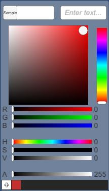
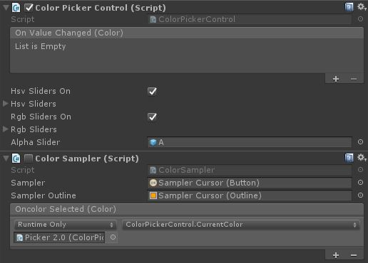
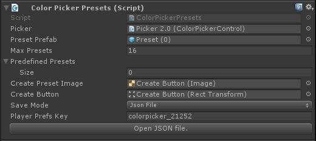
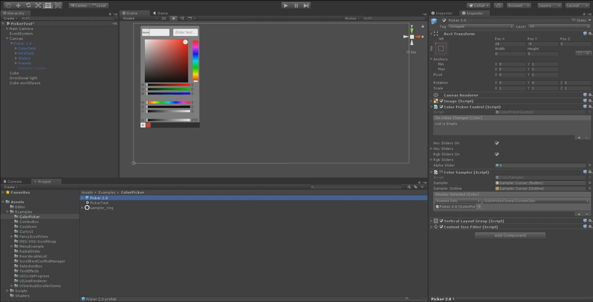

# Color Picker

A generated control using the new [Box Slider](BoxSlider.md) control and several sliders with helpers.

Creates a Color Picker style control to generate color values within a Unity Project. Handles color sampling with a cursor as well as saving/loading presets.

<!---->

---------

## Contents

> 1 [Overview](#overview)
>
> 2 [Properties](#properties)
>
> 3 [Methods](#methods)
>
> 4 [Usage](#usage)
>
> 5 [Video Demo](#video-demo)
>
> 6 [See also](#see-also)
>
> 7 [Credits and Donation](#credits-and-donation)
>
> 8 [External links](#external-links)

---------

## Overview

A generated Color Picker UI with prefab for use in Unity. Includes an optional Color Sampler to pick colors from the screen.





### Color Picker control

Uses the renderer material to expose the selected color from the combined control.

Like the other Unity UI controls, it includes an OnValueChanged event which outputs the Color of the control as it's changed.

### Color Sampler

Captures the screen when it is enabled, then provides a cursor with which the user can select colors from the screen. 



### Color Picker Presets

Manages saving/loading presets to a JSON file or player prefs.

---------

## Properties

### Color Picker Control properties

Example found on the *Picker 2.0* prefab.

Property | Description
|-|-|
*Sampler* (button) |The cursor's button component.
*Sampler Outline* (outline) |The outline of the cursor to make it easier to see what's being sampled.
***On Color Selected*** (event) |Callback for when the cursor is clicked on a color. This should connect to the ColorPickerControl.CurrentColor at minimum.

### Color Sampler properties

Example found on the *Picker 2.0* prefab.
The properties of the Box Slider control are as follows:

Property | Description
|-|-|
***On Value Changed*** (event) |The Event fired when the color within the picker is changed
*HSV sliders on* (bool) |Shows / hides the HSV sliders in te UI prefab.
*HSV Sliders* (GameObject array) |Contains references to the components that are part of the HSV sliders display.
*RGB sliders on* (bool) | Shows / hides the RGB sliders in te UI prefab.
*RGB Sliders* (GameObject array) |Contains references to the components that are part of the RGB sliders display.
*Alpha Slider* (GameObject) |The alphas slider (turns off if both RGB and HSV sliders are off).

### Color Picker Presets properties

Example found on the *Picker 2.0 / Presets* prefab.

Property | Description
|-|-|
*Picker* (ColorPickerControl)| Reference to the color picker control.
*Preset Prefab* (GameObject)| UI component for displaying the preset(s).
*Max Presets* (int)| The max number of presets allowed (to control the UI size).
*Predefined Presets* (Color array)| Colors that will be in the presets regardless of the user-defined presets.
*Create Preset Image* (Image)| The image behind the "+" button. Gets colored when a color is selected.
*Create Button* (RectTransform)| Reference to the button.
*Save Mode* (enum)| None, JSON, PlayerPrefs - the mode used for saving user-defined presets.
*Player Prefs Key* (string)| The JSON file name or the player pref key, the auto-generated one includes the GUID of the gameobject so multiple can exist without conflict (unless you set your own string to be the same on all ColorPickerPresets).

---------

## Methods

This component does not expose public methods beyond inherited behaviour.

---------

## Usage

Simply add the Color Picker object to a canvas in a scene using the prefab located in "*Assets / unity-ui-extensions / Examples / ColorPicker*". Toggle on/off the HSV or RGB sliders as desired.

Feel free to remove any unnecessary sliders or alter UI to meet your needs. Can also use this as a base to create your own picker, just be sure to use the following add-on components:

* ColorField - used to display the current color of the picker
* ColorSlider - used to bind a slider and it's value to the picker, also sets the range to bind (R,G,B,A,H,S,V)
* HSV Box Slider - used to bind a Box Slider control to the color picker
* Hex Color Field - used to bin an Input Field to a color picker and do Hex Code validation

To access the ColorPicker color direct in code:

```csharp
public Renderer pickerRenderer;
public ColorPickerControl picker;

void Awake()
{
    pickerRenderer = GetComponent<Renderer>();
}
// Use this for initialization
void Start()
{
    picker.onValueChanged.AddListener(color =>
    {
        pickerRenderer.material.color = color;
    });
}
```

The ColorPickerPresets and ColorSampler are all set up in the prefab without need for any scripting. However, both can be extended from with relative ease if you need different functionality.

---------

## Video Demo

*Click to play*

[](Images/ColorPickerDemo.mp4 "Box Slider Demo")

---------

## See also

N/A

---------

## Credits and Donation

Credit [judah4](https://forum.unity3d.com/members/judah4.34568/)
Color Sampler and Color Presets [Naphier] (https://bitbucket.org/Naphier/)

---------

## External links

Sourced from - [http://forum.unity3d.com/threads/color-picker.267043/](http://forum.unity3d.com/threads/color-picker.267043/)
