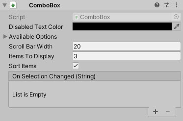

# ComboBox

A fixed combobox implementation for text

<!---->

## Contents

---------

> 1 [Overview](#overview)
>
> 2 [Properties](#properties)
>
> 3 [Methods](#methods)
>
> 4 [Usage](#usage)
>
> 5 [Video Demo](#video-demo)
>
> 6 [See also](#see-also)
>
> 7 [Credits and Donation](#credits-and-donation)
>
> 8 [External links](#external-links)

---------

## Overview

Standard combobox style control with support for multiple textual child items.
Similar to the new built in Unity Dropdown control

---------

## Properties

The properties of the Combo Box control are as follows:

Property | Description
|-|-|
*Available Options*|Array of text based options for the dropdown/selection
*Is Active*|Can the autocomplete combo box be activated by the user (dropped down) or is it disabled?
*Scroll Bar Width*|The width of the scrollbar when displayed
*Items To Display*|Number of child items to display when opened. *Note default 0 shows NO items.
*Dropdown Offset*|Offset height for where the dropdown list should appear.
*Display Panel Above*|Should the dropdown panel appear above the control instead of below?
*Sort Items*|Should the items in the combo box be sorted
*Select First Item On Start*|Should the first item be auto selected on start
*Select Index Item on Start*|Which item should be selected on start (*Select First Item on Start* will override this option)
*On Selection Changed* (event) |The Event fired when the user selects an option or loses focus
*On Control Disabled* (event) |The Event fired when the control is disabled through code.

---------

## Methods

Method | Arguments | Description
|-|-|-|
*AddItem*|String|Adds a single item to the list
*RemoveItem*|String|Removes a single item from the list
*SelectItemIndex*|int|Sets the currently selected item in the list
*SetAvailableOptions*|List of String|Clears the current options and replaces with new list (array or List)
*SetAvailableOptions*|Array of String|Clears the current options and replaces with new list (array or List)
*ResetItems*|N/A|Clears all current options

---------

## Usage

Add the combobox control to your scene using:
GameObject -> UI -> Extensions -> ComboBox

Then simply add child elements to the Items property.  

---------

## Video Demo

---------

## See also

[DropDownList](/Controls/DropDownList.md)
[AutoCompleteComboBox](/Controls/AutoCompleteComboBox.md)

---------

## Credits and Donation

Perchik

---------

## External links

[Sourced from](http://forum.unity3d.com/threads/receive-onclick-event-and-pass-it-on-to-lower-ui-elements.293642/)
