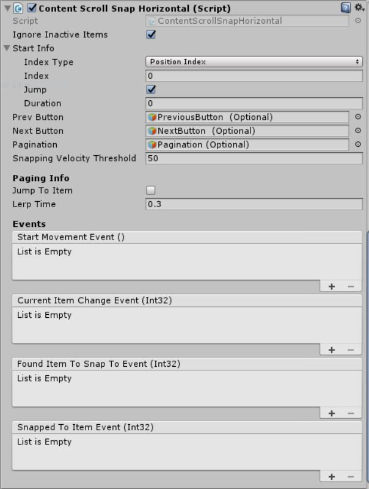
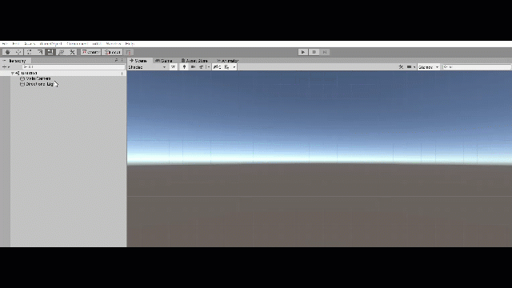

# Content ScrollSnap Horizontal

A list scroll rect that snaps onto the items in its content, includes button & pagination support (optional).

<!---->

---------

## Contents

> 1 [Overview](#overview)
>
> 2 [Properties](#properties)
>
> 3 [Methods](#methods)
>
> 4 [Usage](#usage)
>
> 5 [Video Demo](#video-demo)
>
> 6 [See also](#see-also)
>
> 7 [Credits and Donation](#credits-and-donation)
>
> 8 [External links](#external-links)

---------

## Overview

A scroll snap style control which is focused on a horizontal layout. This layout snaps the children of its content to the center
of the scroll rect, without resizing or moving them, enabling a kind of snapping list functionality, as opposed to paging.
Pages can be moved by swipes or via the use of buttons.

A scroll snap style control which is focused on a horizontal layout, enabling a paged view of child elements.
Pages can be moved by keys, swipes or via the use of buttons.

Implements additional events for when the scroll snap starts moving, when the current item changes, when an item is found to snap to, and when
the scroll snap has finished snapping.

---------

## Properties

The properties of the Horizontal Scroll Snap control are as follows:

Property | Description
-|-
*Ignore Inactive Items*|When enabled the scroll snap ignores inactive items, when disabled the scroll snap will snap to inactive items.
*Start Info*|All information about where the scroll snap should start when it is enabled, and how it should get there.
*Index Type*|A property of Start Info which describes whether the Index is associated with the child at that index, or the position at that index. A higher Index where the Index Type is Position Index means it will be further to the right.
*Index*|A property of Start Info. The index of the child or snap position where the scroll snap will start when enabled.
*Jump*|A property of Start Info. When Jump is true the scroll rect will jump to the Index.
*Duration*|A property of Start Info. If Jump is false the scroll snap will lerp to the Index in this amount of time (in seconds).
*Prev Button*|Button to instruct the control to move to the previous item.
*Next Button*|Button to instruct the control to move to the next item.
*Pagination*|The GameObject with a Toggle group that controls toggles active state. Recommended one toggle per-item.
*Snapping Velocity Threshold*|The velocity below which the scroll snap will start to snap.
*Jump To Item*|When the Prev Button or Next Button are pressed, and Jump To Item is true, the scroll snap will jump to the next/previous item.
*Lerp Time*|When the Prev Button or Next Button are pressed, and Jump To Item is false, the scroll snap will lerp to the next/preivous item in this amount of time (seconds).
***Start Movement*** (event)|The Event fired when the scroll rect starts to move, either via swipe, or Next/Prev Buttons.
***Current Item Change*** (event)|The Event fired when the current (closest) item changes, either via swipe, or Next/Prev Buttons.
***Found Item To Snap To*** (event)|The Event fired when the scroll snap decides what item it is going to snap to, either when the scroll rect's velocity falls below the Snapping Velocity Threshold, or when Next/Prev buttons are pushed.
***Snapped To Item*** (event)|The Event fired when the scroll snap settles after being changed by swipe, or Next/Prev Buttons.

---------

## Methods

Method | Arguments | Description
-|-|-
*SetNewItems*|newItems (List of Transform Items)|Replaces the content with a  new list of items. Content should have a layout control or the new items should be prefabs with positions/anchors already defined.

---------

## Usage

Like with other Layout controls, simply add this to the parent RectTransform for a collection of child elements through the Add Component menu as follows:

"*Add Component -> UI -> Extensions -> ContentSnapScrollHorizontal*"

Or alternatively, add the default layout for the control using:

"*GameObject -> UI -> Extensions -> Layout -> Content Scroll Snap Horizontal*"

This will give you a standard Scroll Rect setup with the script and a few example child items.

---------

## Video Demo

---------

## See also

* [HorizontalScrollSnap](/Controls/HorizontalScrollSnap.md)
* [VerticalScrollSnap](/Controls/VerticalScrollSnap.md)
* [ScrollSnap](/Controls/ScrollSnap.md)

---------

## Credits and Donation

Beka Westberg (Beks_Omega)

---------

## External links

N/A
