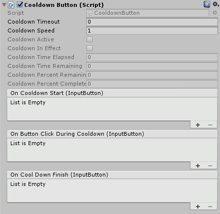
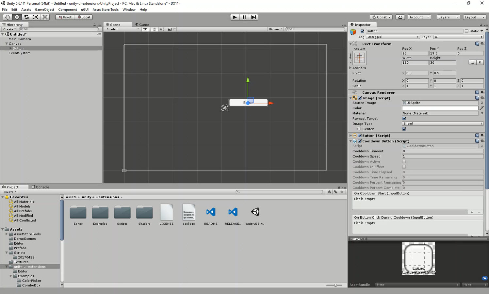

# CooldownButton

A selectable extension to provide a "cooldown" capability, preventing the button from being usable until a specified amount of time has passed.

<!---->

---------

## Contents

> 1 [Overview](#overview)
>
> 2 [Properties](#properties)
>
> 3 [Methods](#methods)
>
> 4 [Usage](#usage)
>
> 5 [Video Demo](#video-demo)
>
> 6 [See also](#see-also)
>
> 7 [Credits and Donation](#credits-and-donation)
>
> 8 [External links](#external-links)

---------

## Overview

In several games, a power-up or cooldown logic is required when clicking on a button, this control enables that behaviour in a single reusable script.

This can be attached to any control implementing "Selectable" behaviour, such as:

* Button
* Toggle
* Non-Drawing Graphic

In the example "Cooldown" scene, it also demonstrates how to pair up this control with other effects such as the SoftMask effect and the native Unity image effects.  Showing how to add a fading/growing style effect when clicked.

Lastly, the control also has "extra" click detection allowing further feedback in it's use, so if a user clicks on the control when it is "cooling down", you can optionally apply additional feedback to inform the users that it can't be clicked as it is cooling down.

---------

## Properties

The properties of the UILineConnector control are as follows:

Property | Description
-|-
*Cooldown Timeout*|The amount of time the cooldown takes effect. Defaults to seconds
*Cooldown Speed*|The speed at which the cooldown expires.
*Cooldown Active*|(Read only)Is the Cooldown active (can be stopped with the CancelCooldown method)
*Cooldown In Effect*|Is the Cooldown active (can be paused with PauseCooldown method and restarted with the RestartCooldown method)
*Cooldown Time Elapsed*|The amount of time (float) that has passed since the cooldown started
*Cooldown Time Remaining*|The amount of time (float) remaining on the cooldown
*Cooldown Percent Remaining*|The percentage of cooldown remaining
*Cooldown Percent Complete*|The percentage of cooldown completed
***On Cooldown Start*** (event)|The Event fires when the user clicks on the control and starts the cooldown
***On Button Click During Cooldown*** (event)|The Event fires when the user clicks on the control while it is cooling down
***On Cooldown Finish*** (event)|The Event fires when the cooldown time has finished

---------

## Methods

This component does not expose public methods beyond inherited behaviour.

---------

## Usage

The CooldownButton control is available as a Game Component menu in:

"*Add Component -> UI -> Extensions -> Cooldown Button*"

Attach to any Selectable UI component (Button, Toggle, etc.) to add cooldown functionality.

---------

## Video Demo

*Click to play*

---------

## See also

* Unity Button (built-in)
* [Non Drawing Graphic](/Controls/NonDrawingGraphic.md)
* [Selectable Extension](/Controls/UISelectableExtension.md)

---------

## Credits and Donation

Credit SimonDarksideJ

---------

## External links

N/A
