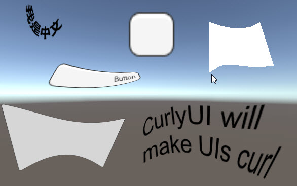
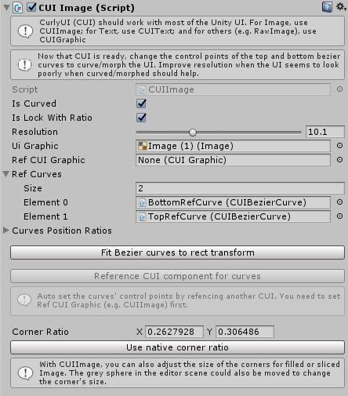
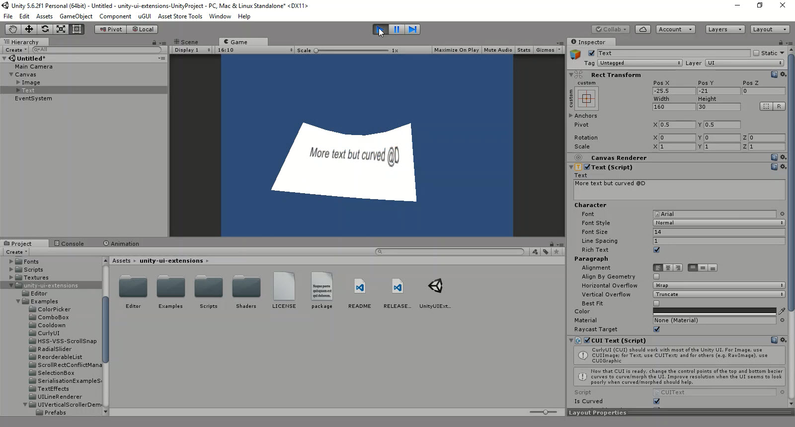

# Curly UI

A UI Effect that will make your UI Curly

---------

## Contents

> 1 [Overview](#overview)
>
> 2 [Properties](#properties)
>
> 3 [Methods](#methods)
>
> 4 [Usage](#usage)
>
> 5 [Video Demo](#video-demo)
>
> 6 [See also](#see-also)
>
> 7 [Credits and Donation](#credits-and-donation)
>
> 8 [External links](#external-links)

---------

## Overview

Curly UI is a set of effect extensions that can alter the RectTransform of your UI Images / Text or RawGraphic's

Once added to either an Image, Text or RawGraphic, you will be presented with some bezier handles to manipulate the curves of your UI component, these help define how you want to curve your UI.

---------

## Properties

The properties of the Curly controls (CUI Image, Text, Graphic) are as follows:

Property | Description
|-|-|
*Is Curved*|Apply the curve affect to the attached element
*Is Lock with Ratio*|Lock curves to the native object ratios
*Resolution*|Complexity of the underlying mesh, increases draw complexity for quality
*UI Graphic*|Graphic element being altered with the curve
*Ref CUI Graphic*|tbc
*Ref Curves*|Collection of CUI Bezier curves to apply to the graphic
*Curves Position Ratios*|Bezier control points for each reference curve (Ref Curves)
*Fit Bezier Curves to rect transform (button)*|Reset Bezier points to native Rect Transform positions
*Reference CUI component for curves (button)*|Reset Bezier points to "Ref CUI Graphic" Rect Transform positions
*Corner Ratio*|Bezier offset for the curve corners
*Use native corner ratio (button)*|Reset corner ratio to native Rect Transform positions

---------

## Usage

Simply add any of the CUI Game Components to an Image/Text/Rawimage object using "*UI / Effects / Extensions / CUI**" in the "*Component*" menu, or the "*Add Component*" button in the inspector.

* CUI Image -> Image
* CUI Text -> Text
* CUI Graphic -> RawImage

Once added, you can then manipulate the curves for the RectTransform using the bezier handles added in the editor.

> *Note* 
> You should be able to manipulate / animate the bezier control points through code, however, this has not been tested as yet.

---------

## Video Demo

*Click to play*

---------

## See also

* [Curved Text](/Controls/CurvedText.md)
* [Cylinder Text](/Controls/CylinderText.md)
* [Curved Layout](/Controls/CurvedLayout.md)

---------

## Credits and Donation

Credit [Titinious](https://github.com/Titinious)

---------

## External links

Sourced from - [https://github.com/Titinious/CurlyUI](https://github.com/Titinious/CurlyUI)
