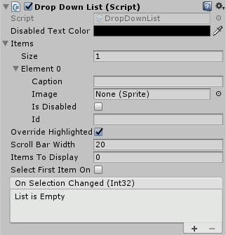

# DropDownList

A basic drop down list with text and image support

<!---->

---------

## Contents

> 1 [Overview](#overview)
>
> 2 [Properties](#properties)
>
> 3 [Methods](#methods)
>
> 4 [Usage](#usage)
>
> 5 [Video Demo](#video-demo)
>
> 6 [See also](#see-also)
>
> 7 [Credits and Donation](#credits-and-donation)
>
> 8 [External links](#external-links)

---------

## Overview

A more advanced Combobox control with additional support for images and other items in the selection pane

---------

## Properties

The properties of the Drop Down List control are as follows:

Property | Description
|-|-|
*Disabled Text Color*|Color of the Autocomplete field when the control is disabled.
*Available Options*|Array of child options options for the dropdown/selection. Each child is configured within the array below:
-*Caption*|Text for the Child item.
-*Image*|Image displayed next to child item.
-*Is Disabled*|Is this child item disabled by default.
-*Id*|Unique identity of the drop down item.
*Is Active*|Can the autocomplete combo box be activated by the user (dropped down) or is it disabled?
*Override Highlighted*|Should the normal highlight behavior of the control be ignored.
*Scroll Bar Width*|The width of the scrollbar when displayed.
*Items To Display*|Number of child items to display when opened. *Note default 0 shows NO items.
*Dropdown Offset*|Offset height for where the dropdown list should appear.
*Display Panel Above*|Should the dropdown panel appear above the control instead of below?
*Select First Item On Start*|Should the first item be auto selected on start?
*Select Index Item on Start*|Which item should be selected on start. (*Select First Item on Start* will override this option)
*On Selection Changed* (event) |The Event fired when the user selects an option or loses focus
*On Control Disabled* (event) |The Event fired when the control is disabled through code.

> When managing the control programmatically, make sure you use the following functions to manage the ComboBox contents. **Do NOT update the 'AvailableOptions' list directly**

---------

## Methods

Method | Arguments | Description
|-|-|-|
*AddItem*|DropDownListItem|Adds a new item to the drop down list and rebuilds the display
*AddItem*|String|Adds a new item to the drop down list and rebuilds the display
*AddItem*|Sprite|Adds a new item to the drop down list and rebuilds the display
*RemoveItem*|DropDownListItem|Removes an item from the drop down list and rebuilds the display
*RemoveItem*|String|Removes an item from the drop down list and rebuilds the display
*RemoveItem*|Sprite|Removes an item from the drop down list and rebuilds the display
*RefreshItems*|Array of supported items (DropDownListItem, String or Sprite)|Clears the current list and rebuilds a new list with the provided items
*SelectItemIndex*|int|Sets the currently selected item in the list
*ResetItems*|N/A|Clears all current options

---------

## Usage

Add the DropDownList control to your scene using:
GameObject -> UI -> Extensions -> DropDownList

Then simply add drop down elements to the Items property.  Additionally, Images and other items may be added to enhance the drop down items

---------

## Video Demo

---------

## See also

[ComboBox](/Controls/ComboBox.md)
[AutoCompleteComboBox](/Controls/AutoCompleteComboBox.md)

---------

## Credits and Donation

Perchik

---------

## External links

[Sourced from](http://forum.unity3d.com/threads/receive-onclick-event-and-pass-it-on-to-lower-ui-elements.293642/)
