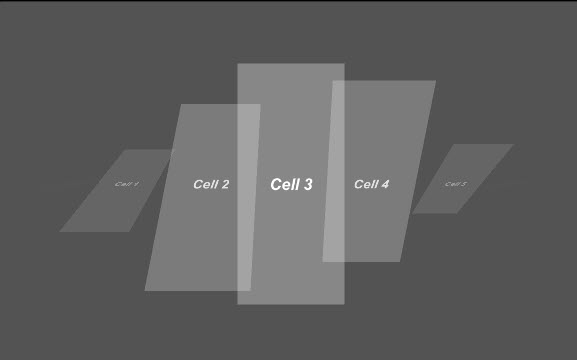
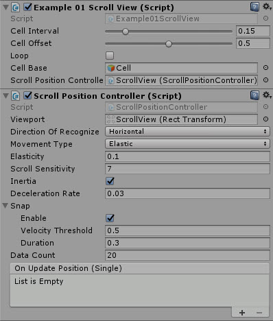

# Fancy Scroll View

A very fancy Scroll view component, with an extensible event system



---------

## Contents

> 1 [Overview](#overview)
>
> 2 [Properties](#properties)
>
> 3 [Usage](#usage)
>
> 4 [Video Demo](#video-demo)
>
> 5 [See also](#see-also)
>
> 6 [Credits and Donation](#credits-and-donation)
>
> 7 [External links](#external-links)

---------

## Overview

Fancy Scroll View is a programmatic way to build a scroll view component with several extensible features.



The control is made up of several Key Components:

* Scroll Position Controller (SPC) - a replacement ScrollRect control
* Scroll View script (custom) - The Scroll View controller that consumes the SPC
* Scroll View Cell (custom) - The Scroll view item template factory
* (optional) Cell DTO template - A script that defines the cell content that the factory consumes

Implementation of this control is almost entirely programmatic, with several examples provided in the Examples folder:

* 01_Basic Example - Simple non-selectable scroll view, scene has an initialization script on the Canvas to load test data in the scrollview. Includes animation effects for the cells.
* 02_CellEvents - Replicates Example 1, adding event handlers and click handlers for cells which fire off events when clicked
* 03_InfiniteScroll - An advanced implementation which uses scene depth rather than width/height and also implements the events from example 2

---------

## Properties

The properties of the Scroll Position Controller are as follows:

Property | Description
|-|-|
*ViewPort*|Restricted bounds of the Scroll View Position controller
*Direction of Recognize*|Direction of movement, Horizontal or Vertical
*Movement Type*|Complexity of the underlying mesh, increases draw complexity for quality
*Elasticity*|Graphic element being altered with the curve
*Scroll Sensitivity*|tbc
*Inertia*|Collection of CUI Bezier curves to apply to the graphic
*Deceleration Rate*|Bezier control points for each reference curve (Ref Curves)
*Snap Section*
    *Enable*|Reset Bezier points to native Rect Transform positions
    *Velocity Threshold*|Reset Bezier points to "Ref CUI Graphic" Rect Transform positions
    *Duration*|Bezier offset for the curve corners
*Data Count*|Reset corner ratio to native Rect Transform positions
*On Value Changed* (event) |The Event fired when the handle within the box slider is changed

The properties of the ScrollView template (FancyScrollView class) are as follows:

Property | Description
|-|-|
*Cell Interval*|Apply the curve affect to the attached element
*Cell Offset*|Lock curves to the native object ratios
*Loop*|Complexity of the underlying mesh, increases draw complexity for quality
*Cell Base*|Graphic element being altered with the curve

---------

## Usage

To use this control you will need to programmatically build and tailor it for your own use.  The examples provided in the "Examples\FancyScrollView" folder will help.

As described earlier, you will need to create:

* A cell data template (optional but recommended if you want to load data to view)

For example

```csharp
    public class Example01CellDto
    {
        public string Message;
    }
```

* A Cell template script - to initialize your content and control what happens when the cell is moved (e.g. apply animation)

For example

```csharp
    public class Example01ScrollViewCell : FancyScrollViewCell<Example01CellDto>
    {
        [SerializeField]
        Animator animator;  //Example to attach an animator
        [SerializeField]
        Text message; // Example field to bind a cell text field value to

        readonly int scrollTriggerHash = Animator.StringToHash("scroll"); //Animation in the animator to use as the system uses Hashes not text

        //initialization to setup Cell Rect Transform
        void Start()
        {
            var rectTransform = transform as RectTransform;
            rectTransform.anchorMax = Vector2.one;
            rectTransform.anchorMin = Vector2.zero;
            rectTransform.anchoredPosition3D = Vector3.zero;
            UpdatePosition(0);
        }

        //UpdateContent method from the base FancyScrollViewCell class to apply changes on update
        public override void UpdateContent(Example01CellDto itemData)
        {
            message.text = itemData.Message;
        }

        //UpdatePosition method from the base FancyScrollViewCell class to react or alter what happens when the cell position moves
        public override void UpdatePosition(float position)
        {
            animator.Play(scrollTriggerHash, -1, position);
            animator.speed = 0;
        }
    }
```

* A ScrollView Implementation consuming your data template and binding the ScrollView to the Position controller

For example

```csharp
    public class Example01ScrollView : FancyScrollView<Example01CellDto>
    {
        [SerializeField]
        ScrollPositionController scrollPositionController;

        new void Awake()
        {
            base.Awake();
            scrollPositionController.OnUpdatePosition.AddListener(UpdatePosition);
        }

        public void UpdateData(List<Example01CellDto> data)
        {
            cellData = data;
            scrollPositionController.SetDataCount(cellData.Count);
            UpdateContents();
        }
    }
```

All that is left then is to intialise the ScrollView with your data and let it run.

> *For additional help*
> See the [documentation provided by the Developer in the original repository](https://github.com/setchi/FancyScrollView).  Note however, it is not in English currently and needs translating.

---------

## Video Demo

*Click to play*


---------

## See also

* [HorizontalScrollSnap](/Controls/HorizontalScrollSnap.md)
* [VerticalScrollSnap](/Controls/VerticalScrollSnap.md)
* [ScrollSnap](/Controls/ScrollSnap.md)

---------

## Credits and Donation

Credit [setchi](https://github.com/setchi)

---------

## External links

Sourced from - [https://github.com/setchi/FancyScrollView](https://github.com/setchi/FancyScrollView)
