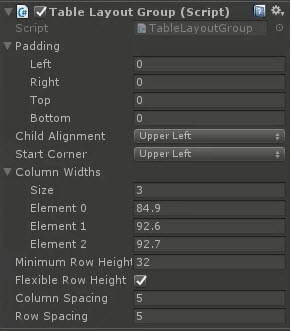

# FlowLayoutGroup

A more rugged grid style layout group

<!---->

---------

## Contents

> 1 [Overview](#overview)
>
> 2 [Properties](#properties)
>
> 3 [Methods](#methods)
>
> 4 [Usage](#usage)
>
> 5 [Video Demo](#video-demo)
>
> 6 [See also](#see-also)
>
> 7 [Credits and Donation](#credits-and-donation)
>
> 8 [External links](#external-links)

---------

## Overview

A more rugged grid style layout group

---------

## Properties

The properties of the Box Slider control are as follows:

Property | Description
|-|-|
*Handle Rect*|The Rect Transform of the child handle, position used to derive values for control
*Min Value*|The minimum value for the sliders
*Max Value*|The maximum value for the sliders
*Whole Numbers*|Only use whole numbers instead of floats
*Value X*|The X value of the slider
*Value Y*|The Y value of the slider
*On Value Changed* (event) |The Event fired when the handle within the box slider is changed

## Inherited from Slider

* Interactable
* Transition
* Navigation

---------

## Usage

Like with other Layout controls, simply add this to the parent RectTransform for a collection of child elements through the Add Component menu as follows:
Add Component -> Layout -> Extensions -> Flow Layout Group

---------

## Video Demo

---------

## See also

* [Curved Layout Group](/Controls/CurvedLayout.md)
* [Radial Layout Group](/Controls/RadialLayout.md)
* [Table Layout Group](/Controls/TableLayoutGroup.md)

---------

## Credits and Donation

Simie

---------

## External links

[Sourced from](http://forum.unity3d.com/threads/flowlayoutgroup.296709/)
