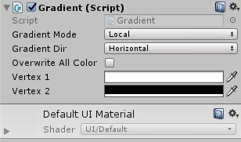
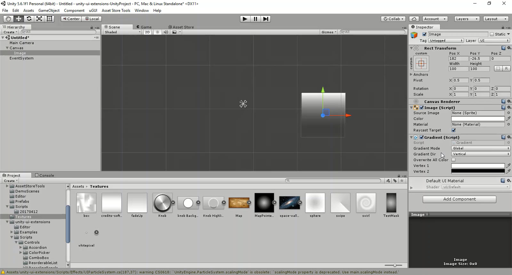

# Gradient

Apply vertex colours in a gradient on any UI object

<!---->

---------

## Contents

> 1 [Overview](#overview)
>
> 2 [Properties](#properties)
>
> 3 [Methods](#methods)
>
> 4 [Usage](#usage)
>
> 5 [Video Demo](#video-demo)
>
> 6 [See also](#see-also)
>
> 7 [Credits and Donation](#credits-and-donation)
>
> 8 [External links](#external-links)

---------

## Overview

Apply vertex colours in a gradient on any graphic UI object

---------

## Properties

The properties of the Box Slider control are as follows:

Property | Description
|-|-|
*Gradient Mode*|Should the gradient work in Local or Global coordinate space
*Gradient Dir*|The direction of the gradient: Horizontal / Vertical / Diagonal left to right / diagonally right to left
*Override all color*|Should the control use or ignore the alpha of the original image for the effect
*Vertex 1*|First gradient color
*Vertex 2*|Second gradient color

---------

## Usage

To enable the Gradient component, simply add the component to a UI Graphic Object using:
Add Component -> UI -> Extensions -> Effects -> Gradient

---------

## Video Demo

*Click to play*

---------

## See also

* [Gradient2](/Controls.md/Gradient2)

---------

## Credits and Donation

Breyer
---------

## External links

[Sourced from](http://forum.unity3d.com/threads/scripts-useful-4-6-scripts-collection.264161/#post-1780095)
