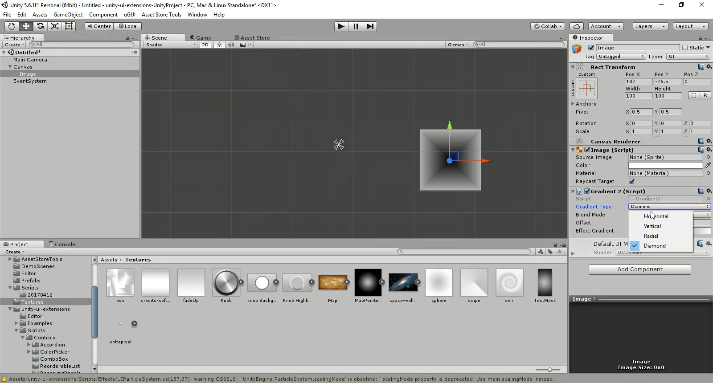

# Gradient2

Apply vertex colours in a gradient on any UI object

---------

## Contents

> 1 [Overview](#overview)
>
> 2 [Properties](#properties)
>
> 3 [Methods](#methods)
>
> 4 [Usage](#usage)
>
> 5 [Video Demo](#video-demo)
>
> 6 [See also](#see-also)
>
> 7 [Credits and Donation](#credits-and-donation)
>
> 8 [External links](#external-links)

---------

## Overview

Apply vertex colours in a gradient on any graphic UI object

---------

## Properties

The properties of the Gradient2 control are as follows:

Property | Description
|-|-|
*Gradient Type*|The Type of Gradient to be used: Horizontal / Vertical / Radial (inside to outside) / Diamond
*Blend Mode*|How should the gradient apply: Override / Add / Multiply
*Modify Vertices*|Change the vertices of the image to apply the gradient
*OffSet*|How much of the gradient should be applied, allows for grading in the gradient (all inception like)
*Zoom*|Zoom in to the effect Gradient at the specified offset
*Effect Gradient*|A gradient scale using the Unity Gradient tool which allows setting of multiple gradients

---------

## Usage

To enable the Gradient component, simply add the component to a UI Graphic Object using:
Add Component -> UI -> Extensions -> Effects -> Gradient2

> *Note*
> The control works based on the base vertices of the UI object it is applied to.  If the object only has 4 vertices (a Quad like the base image) it can only project values between 0 & 1, meaning mid values on the gradient can't take effect.  To improve the gradient on a GO, the base object will need enough vertices to apply the gradient, a quad is not sufficient.
> May look to add a control to the project to improve the resolution of a base image / quad to add more vertices in the future.

---------

## Video Demo

*Click to play*

---------

## See also

* [Gradient](/Controls/Gradient.md)

---------

## Credits and Donation

* Brad Nelson (playemgames)
* David Gileadi

---------

## External links

[Sourced from](http://answers.unity3d.com/questions/1086415/gradient-text-in-unity-522-basevertexeffect-is-obs.html)

[Updated Gradient Effect](https://bitbucket.org/UnityUIExtensions/unity-ui-extensions/pull-requests/15/support-complex-linear-gradients-gradient/diff)
