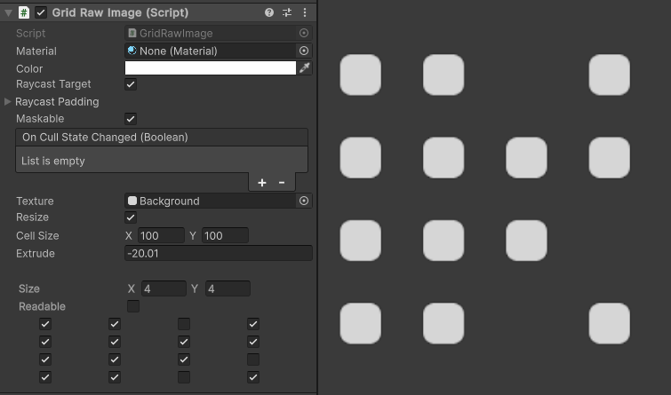
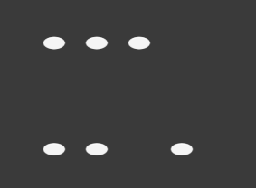
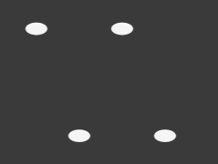
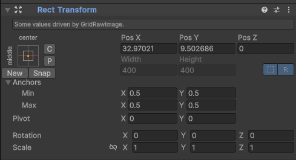

# UI Grid Raw Image

Custom graphic for uGUI. Single-object/texture Grid image, excellent for tile-based (tetris-like) inventory

<!---->

---------

## Contents

> 1 [Overview](#overview)
>
> 2 [Properties](#properties)
>
> 3 [Methods](#methods)
>
> 4 [Usage](#usage)
>
> 5 [Video Demo](#video-demo)
>
> 6 [See also](#see-also)
>
> 7 [Credits and Donation](#credits-and-donation)
>
> 8 [External links](#external-links)

---------

## Overview

Custom graphic for uGUI. Single-object/texture Grid image, excellent for tile-based (tetris-like) inventory.

### Features

- 1 texture / 1 GameObject / 1 drawcall
- skip cells
- valid raycasting by geometry for input
- resize rectTransform to fit
- extrude edges (inner outer)
- Non-rectangle cells
- script-based, no custom shader

---------

## Properties

The Accordion setup uses two components:

Property | Description
-|-
*Texture*|Texture to use for each cell.
*Resize*|Factor by how each cell is resized.
*Cell Size*|The dimensions per cell.
*Extrude*|Extrusion surrounding the cell.
*Shape*|The grid size, including configuration for which cells are active.

## Inherited from MaskableGraphic

- Material
- Color
- Raycast Target
- Maskable

## Methods

This component does not expose public methods beyond inherited behaviour.

---------

## Usage

...

---------

## Video Demo

[Youtube usage video](https://youtu.be/E7Ouh1k3No0?si=mEKckcfdjrP_Yf0Z)

---------

## See also

---------

## Credits and Donation

ChoMPHi

---------

## External links

[Sourced from](http://forum.unity3d.com/threads/accordion-type-layout.271818/)

---------
