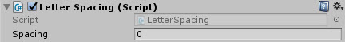
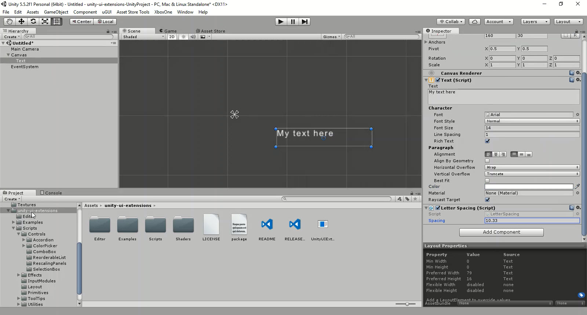

# LetterSpacing

Allows finer control of text spacing

<!---->

---------

## Contents

> 1 [Overview](#overview)
>
> 2 [Properties](#properties)
>
> 3 [Methods](#methods)
>
> 4 [Usage](#usage)
>
> 5 [Video Demo](#video-demo)
>
> 6 [See also](#see-also)
>
> 7 [Credits and Donation](#credits-and-donation)
>
> 8 [External links](#external-links)

---------

## Overview

Allows finer control of text spacing

---------

## Properties

The properties of the Letter Spacing component are as follows:

Property | Description
|-|-|
*Spacing*|The spacing distance between characters

---------

## Usage

Simply add this to a Text component through the Add Component menu as follows:
Add Component -> UI -> Effects -> Extensions -> Letter Spacing

---------

## Video Demo

*Click to play*

---------

## See also

[Curved Text](/Controls.md/CurvedText)
[Cylinder Text](/Controls.md/CylinderText)
[Mono Spacing](/Controls.md/MonoSpacing)

---------

## Credits and Donation

Deeperbeige

---------

## External links

[Sourced from](http://forum.unity3d.com/threads/adjustable-character-spacing-free-script.288277/)
