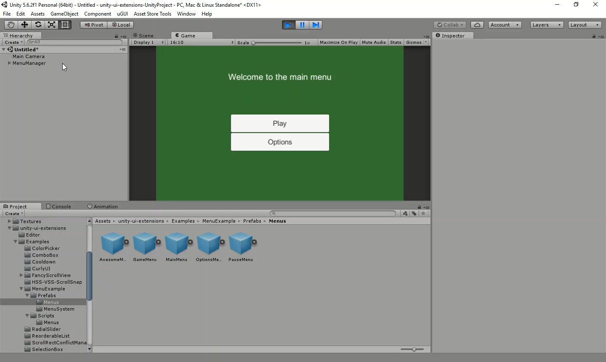

# Unite Menu System

The example Menu system demonstrated at Unite Europe 2017, refactored and updated as a generic reusable system.

---------

## Contents

> 1 [Overview](#overview)
>
> 2 [Properties](#properties)
>
> 3 [Methods](#methods)
>
> 4 [Usage](#usage)
>
> 5 [Video Demo](#video-demo)
>
> 6 [See also](#see-also)
>
> 7 [Credits and Donation](#credits-and-donation)
>
> 8 [External links](#external-links)

---------

## Overview

At Unite 2017, a team demonstrated an easy to use approach to build an extendable and dynamic menu system for any project.
**[Video Link](https://www.youtube.com/watch?v=wbmjturGbAQ)**

This has been updated / refactored in to a reusable feature with a little work based on a set of generic components, at it's Core is the "Menu Manager" which manages all menus and a set of implementation templates for building the Menu's in your game.

Once the manager has been added to your starting / master scene, it will control the flow between all "screens" in your project.
It is still quite basic at the moment and only loads/displays each screen UI canvas, so there is room for improvement.

---------

## Properties

The properties of the Menu Manager are as follows:

Property | Description
-|-
*Menu Screens*|Collection of Menu prefabs for each menu in the game
*Start Screen*|The initial menu screen the Menu Manager will load when the game is launched

### Additional properties available on Menu base classes

Property | Description
-|-
*Destroy When Closed*|Destroy the Game Object when menu is closed (reduces memory usage)
*Disable Menus Underneath*|Disable menus that are under this one in the stack

---------

## Methods

This component does not expose public methods beyond inherited behaviour.

---------

## Usage

Simply add "Menu Manager" component to a GameObject using:

"*GameObject -> UI -> Extensions -> Menu Manager*"

or through the Add Component menu:

"*Add Component -> UI -> Extensions -> Menu System -> Menu Manager*"

Next you will need to build your Menu UI Prefabs, including a Menu scripts based upon either of these two templates:

* Menu - A blank Menu implementation that utilises a Singleton to easily reference the menu from the game or manager
* SimpleMenu - A rough implementation that implements some basic functionality for simple screens.

Simple Create a Canvas and design your UI with whatever UI components you need.  Attach a script with the name of the menu (E.G. MainMenu, Options, Controls, etc) which implements either the Menu, SimpleMenu Base Classes.  Then save the Canvas as a Prefab using the same name that was used for the Menu Script (see note).  Once done, add that menu prefab to the menu manager.

In the "Examples" Folder, there is a full working implementation to based your own design on.

> [!NOTE]
> Currently, each "Menu" script *MUST* have the same name as the Menu prefab in order for the Menu manager to recognize it

---------

## Video Demo

*Click to play*

---------

## See also

N/A

---------

## Credits and Donation

Credit [Adam Kapos (Nezz)](http://www.songarc.net)

---------

## External links

Sourced from - [https://github.com/YousicianGit/UnityMenuSystem](https://github.com/YousicianGit/UnityMenuSystem)
Also check the [Unite Talk](https://www.youtube.com/watch?v=wbmjturGbAQ) for the component
