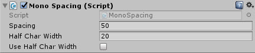
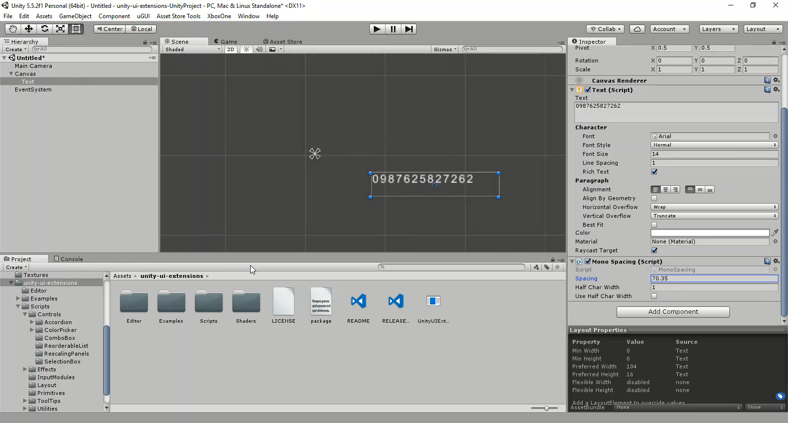

# MonoSpacing

Allows finer control of text spacing

<!---->

> Text Effects are not supported with TextMeshPro due to its architecture, try using the native TextMeshPro effects instead.

---------

## Contents

> 1 [Overview](#overview)
>
> 2 [Properties](#properties)
>
> 3 [Methods](#methods)
>
> 4 [Usage](#usage)
>
> 5 [Video Demo](#video-demo)
>
> 6 [See also](#see-also)
>
> 7 [Credits and Donation](#credits-and-donation)
>
> 8 [External links](#external-links)

---------

## Overview

Allows finer control of text spacing

---------

## Properties

The properties of the Mono Spacing component are as follows:

Property | Description
|-|-|
*Spacing*|The spacing distance between characters
*Half Char Width*|Width modifer using half the character width
*Use Half Char Width*|Apply the additional half char width modifier

---------

## Usage

Simply add this to a Text component through the Add Component menu as follows:
Add Component -> UI -> Effects -> Extensions -> Mono Spacing

---------

## Video Demo

*Click to play*

---------

## See also

[Curved Text](/Controls/CurvedText.md)
[Cylinder Text](/Controls/CylinderText.md)
[Letter Spacing](/Controls/LetterSpacing.md)

---------

## Credits and Donation

Credit herbst

---------

## External links

[Sourced from](http://forum.unity3d.com/threads/adjustable-character-spacing-free-script.288277/)
