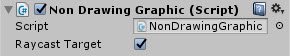
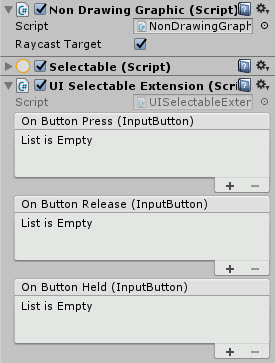
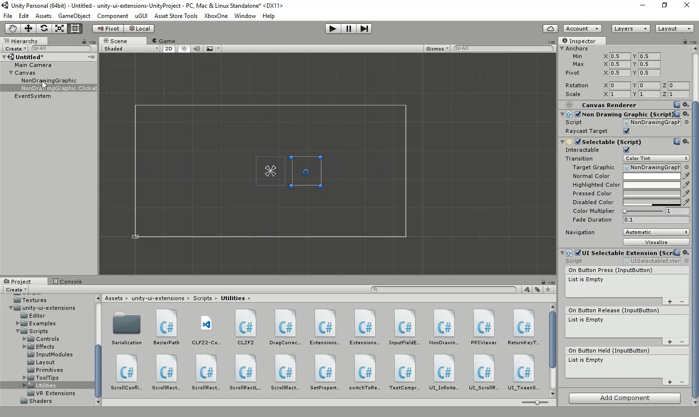

# Non-Drawing Graphic

A graphic component with zero draw calls, useful (when paired with a click script or the Selectable Extension) for invisible buttons or hit test blockers.

<!---->

---------

## Contents

> 1 [Overview](#overview)
>
> 2 [Properties](#properties)
>
> 3 [Methods](#methods)
>
> 4 [Usage](#usage)
>
> 5 [Video Demo](#video-demo)
>
> 6 [See also](#see-also)
>
> 7 [Credits and Donation](#credits-and-donation)
>
> 8 [External links](#external-links)

---------

## Overview

The Non Drawing Graphic component allows you to add a graphic hit testable area with zero draw calls.  The Raycast hit test can also be enabled or disabled (instead of using a CanvasGroup)

It is also very useful when paired with the Selectable Extension to add Click, Release and Hold capabilities.

---------

## Properties

The properties of the Non Drawing Graphic component are as follows:

Property | Description
-|-
*Raycast Target*|Should this GO block raycasts or not.  Changeable in code or editor.

---------

## Methods

This component does not expose public methods beyond inherited behaviour.

---------

## Usage

Simply add the default Non Drawing Graphic component to a RectTransform using:

"Add Component -> Layout -> Extensions -> NonDrawingGraphic" 

There is also a "Clickable" version, which includes the additional components to make the NonDrawing Graphic support events when clicked.

*Note, in Source there are also two Editor menu's to add an Empty GO with the component attached and on to add the Non Drawing Graphic with the additional Selectable Extension.
These will be added to the asset in the next update.

---------

## Video Demo

*Click to play*

---------

## See also

* [Selectable Extension](/Controls/UISelectableExtension.md)
(to add the extended click behaviour to this component)

---------

## Credits and Donation

Credit [Slipp Douglas Thompson / capnslipp ](https://github.com/capnslipp)
Submitted by [PixelEnvision](https://github.com/PixelEnvision)

---------

## External links

Sourced from - [https://gist.github.com/capnslipp/349c18283f2fea316369/](https://gist.github.com/capnslipp/349c18283f2fea316369)
