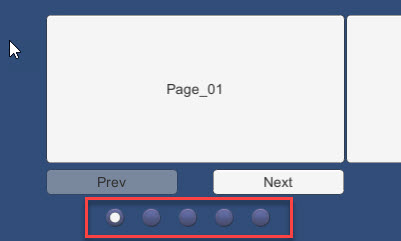
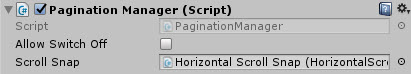

# Pagination Manager

A management script to attach to the Horizontal or Vertical Scroll snaps to enable automatic click navigation.

---------

## Contents

> 1 [Overview](#overview)
>
> 2 [Properties](#properties)
>
> 3 [Methods](#methods)
>
> 4 [Usage](#usage)
>
> 5 [Video Demo](#video-demo)
>
> 6 [See also](#see-also)
>
> 7 [Credits and Donation](#credits-and-donation)
>
> 8 [External links](#external-links)

---------

## Overview

The Pagination Manager enables automatic click navigation for the Pagination features of the Horizontal and Vertical Scroll Snap controls.

The control extends the base Unity ToggleGroup functionality by interlinking the Scroll Snap's functionality with the ToggleEvents automatically.

> *Note* you still have to set up the child toggles manually and ensure that the number of toggles matches the number of Scroll Snap Children.  May extend in the future to automatically generate children from Prefabs.

---------

## Properties

The properties of the Box Slider control are as follows:

Property | Description
|-|-|
*Scroll Snap*|The Horizontal or Vertical Scroll Snap control this Pagination is assocated with (overrides base Pagination capability)

### Inherited from ToggleGroup

* Allow Switch Off (non-functional)

---------

## Usage

Simply add the "Pagination Manager" component from the Game Component menu in "*UI / Extensions / Pagination Manager*". However, you will need to manually assign the *Scroll Snap* reference.

> *Note* this replaces the inherent pagination feature of the Scroll Snap.
---------

## Video Demo

See the "Pagination Manager" example scene in the "HSS-VSS-ScrollSnap" Examples folder

---------

## See also

N/A

---------

## Credits and Donation

Credit [Brogan King](https://bitbucket.org/BroganKing/)

---------

## External links

Sourced from - [https://bitbucket.org/UnityUIExtensions/unity-ui-extensions/issues/158/pagination-script](https://bitbucket.org/UnityUIExtensions/unity-ui-extensions/issues/158/pagination-script)
