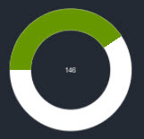
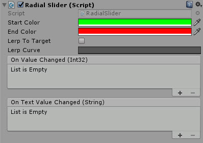
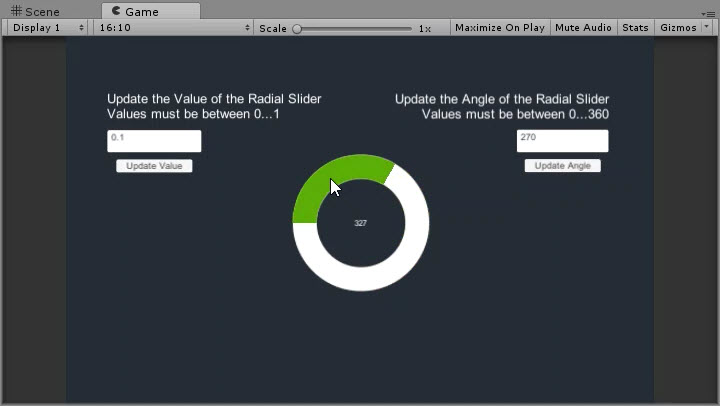

# Radial Slider

A radial slider which fills in a circular pattern

---------

## Contents

> 1 [Overview](#overview)
>
> 2 [Properties](#properties)
>
> 3 [Methods](#methods)
>
> 4 [Usage](#usage)
>
> 5 [Video Demo](#video-demo)
>
> 6 [See also](#see-also)
>
> 7 [Credits and Donation](#credits-and-donation)
>
> 8 [External links](#external-links)

---------

## Overview

The Radial Slider is a graphical fill control utilizing Unity's native Image fill capabilities.

It allows you to define a color range for the slider in a circular pattern beginning from the Left hand side (rotate the control for other starting points.)
It also has built in Lerping capability and can be used to:

* Move value to Click
* Move value to drag
* Click to Lerp

> For this first release, the control is fixed to start at zero.  may improve the control (if needed) to support a different start.  If you need a different start for now, set the Value/Angle on Start/Awake and NOT in the editor.

---------

## Properties

The properties of the Radial Slider control are as follows:

Property | Description
|-|-|
*Start Color*|The Gradient color for the beginning of the radius.
*End Color*|The Gradient color for the end of the radius.
*Lerp To Target*|Should the control jump to it's intended position or Lerp. *Note, Dragging is only supported when this is off
*Lerp Curve*|Use a standard Lerp or a gradient curve using the Unity native Curve control.
*On Value Changed* (event) |The Event fired when the value of the slider is changed, outputs an Integer value
*On Value Changed* (event) |The Event fired when the value of the slider is changed, outputs an Text value

---------

## Usage

Simply add the default Radial Slider to the scene using "*UI / Extensions / Radial Slider*" in the Editor "*GameObject*" menu.

It is also available as a Game Component menu in "*UI / Extensions / Radial Slider*".

---------

## Video Demo

*Click to play*

---------

## See also

* tbc

---------

## Credits and Donation

Credit mgear

---------

## External links

Sourced from - [https://forum.unity3d.com/threads/radial-slider-circle-slider.326392/#post-3143582](https://forum.unity3d.com/threads/radial-slider-circle-slider.326392/#post-3143582)
