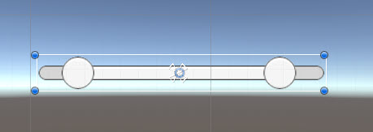
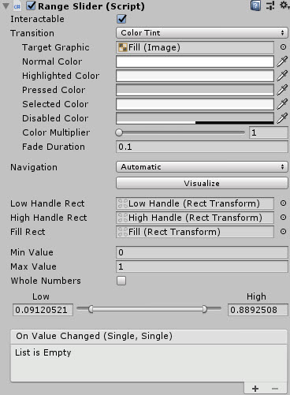
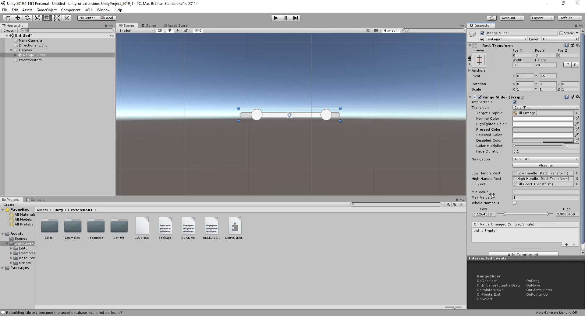

# Range Slider

A UI Slider control with a min (low) and max (high) value

---------

## Contents

> 1 [Overview](#overview)
>
> 2 [Properties](#properties)
>
> 3 [Methods](#methods)
>
> 4 [Usage](#usage)
>
> 5 [Video Demo](#video-demo)
>
> 6 [See also](#see-also)
>
> 7 [Credits and Donation](#credits-and-donation)
>
> 8 [External links](#external-links)

---------

## Overview

A Ui control which allows you to have two slider values in a single control

---------

## Properties

The properties of the Range Slider control are as follows:

Property | Description
|-|-|
*Low Handle Rect*|The RectTransform of the Low value handle graphic
*High Handle Rect*|The RectTransform of the High value handle graphic
*Fill Rect*|RectTramsform of the fill for the slider (between min and max)
*Min Value*|The minimum / lower value for the control
*Max Value*|The maximum / higher value for the control
*Whole Numbers*|Should the control use whole or precision numbers
*On Value Changed* (event) |The Event fires when the range is changed

---------

## Usage

To enable the Gradient component, simply add a new UI Object using:
Menu -> GameObject -> UI -> Extensions -> Range Slider

---------

## Video Demo

*Click to play*

---------

## See also

None

---------

## Credits and Donation

* Ben MacKinnon (@Dover8)

---------

## External links

[Sourced from](https://github.com/Dover8/Unity-UI-Extensions/tree/range-slider)
