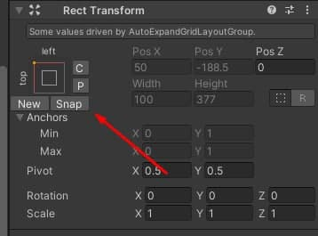

# RectTransformEditor

RectTransform helper utility.

<!---->

---------

## Contents

> 1 [Overview](#overview)
>
> 2 [Properties](#properties)
>
> 3 [Methods](#methods)
>
> 4 [Usage](#usage)
>
> 5 [Video Demo](#video-demo)
>
> 6 [See also](#see-also)
>
> 7 [Credits and Donation](#credits-and-donation)
>
> 8 [External links](#external-links)

---------

## Overview

Add small buttons to RectTransform to help with RectTransform operation.

- C - Copy values to clipboard
- P - Paste values to clipboard
- New - create new parent RectTransform, with same anchor settings, and stretch selected RectTransform to it
- Snap - stretch selected RectTransform to parent

---------

## Properties

This component does not expose public properties beyond inherited behaviour.

## Methods

This component does not expose public methods beyond inherited behaviour.

---------

## Usage

[See #Overview](#overview)

---------

## Video Demo

N/A

---------

## See also

N/A

---------

## Credits and Donation

ChoMPHi

---------

## External links

[Sourced from](https://github.com/mitay-walle/com.mitay-walle.rect-transform-editor)

---------
