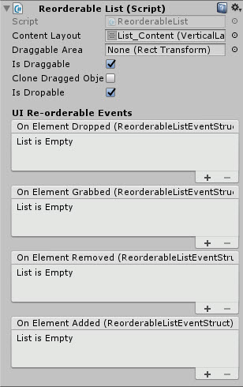

# Re-orderable List

A collection of List Grid control which allow for drag / drop reordering of the child items.  Includes features to move / clone or freeze containers

<!---->

---------

## Contents

> 1 [Overview](#overview)
>
> 2 [Properties](#properties)
>
> 3 [Methods](#methods)
>
> 4 [Usage](#usage)
>
> 5 [Video Demo](#video-demo)
>
> 6 [See also](#see-also)
>
> 7 [Credits and Donation](#credits-and-donation)
>
> 8 [External links](#external-links)

---------

## Overview

The Re-orderable list is a very powerful control which includes several "out of the box" setups, including:

* Vertical, Horizontal and Grid layouts
* Vertical, Horizontal and Grid layouts using a ScrollRect

The control can be enabled in multiple flavors, featuring such capabilities as:

* Allowing Dragging (allows containers that can be dropped in to but not removed)
* Clone or Move child elements
* Allowing dropping (containers that be dragged from but not dropped in to)

As well as events for each state of the child content as they are interacted with.

---------

## Properties

The properties of the Re-orderable List control are as follows:

Property | Description
-|-
*Content layout*|The container holding the child content (similar to the ScrollRect content property)
*Draggable Area*|Defaults to the Content Layout / parent rect transform, but can be overridden to identify an alternate supported dragging space
*Is Draggable*|Can child object be dragged from this container
*Clone Dragged Object*|If true, a copy is made of the original content when dragging, else it moves the original child content item
*Is Dropable*|Can objects be dropped in to this container
***On Element Dropped*** (event) |The Event fired when a child item is released by a user
***On Element Grabbed*** (event) |The Event fired when a child item is being held by the user
***On Element Removed*** (event) |The Event fired when a child item is removed from a container
***On Element Added*** (event) |The Event fired when a child item is added from a container

The properties of the individual Re-orderable List Items are as follows:

Property | Description
-|-
*Is Grabbable*|Can the object be grabbed from a re-orderable list
*Is Transferable*|Can the object be transferred from one re-orderable list to the next
*Is Droppable In Space*|Can the item be dropped outside of a re-orderable list. *note, once dropped outside they cannot be picked up again.

---------

## Methods

This component does not expose public methods beyond inherited behaviour.

---------

## Usage

Simply add the default Re-orderable List control to the scene using one of the pre-built options in the Editor "*GameObject*" menu:

* "*GameObject -> UI -> Extensions -> Re-orderable Lists -> Re-orderableList Vertical List*"
* "*GameObject -> UI -> Extensions -> Re-orderable Lists -> Re-orderableList Horizontal List*"
* "*GameObject -> UI -> Extensions -> Re-orderable Lists -> Re-orderableList Grid*"
* "*GameObject -> UI -> Extensions -> Re-orderable Lists -> Re-orderableList Vertical ScrollRect*"
* "*GameObject -> UI -> Extensions -> Re-orderable Lists -> Re-orderableList Horizontal ScrollRect*"
* "*GameObject -> UI -> Extensions -> Re-orderable Lists -> Re-orderableList Grid ScrollRect*"

The base control is also available as a component menu:

"*Add Component -> UI -> Extensions -> Re-orderable list*"

Note: When using the Add Component menu, you will need to manually set up the control.

---------

## Video Demo

*Click to play*

---------

## See also

N/A

---------

## Credits and Donation

Credit Ziboo

---------

## External links

Sourced from - [http://forum.unity3d.com/threads/free-reorderable-list.364600/](http://forum.unity3d.com/threads/free-reorderable-list.364600/)
