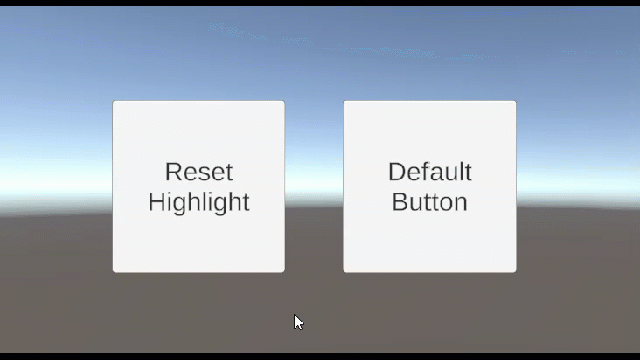

# ResetSelectableHighlight

Handy Selectable script to un-highlight a selectable component in Unity (e.g. a Button) when the user moves away from it, EVEN IF the user has holding a button on it.

Resolves the situation where Unity UI Components remain in a highlighted state even after the pointer has moved away (e.g. user holding a button, mouse, pointer down).
Now whenever the cursor leaves the component, it will force the UI component to revert to un-highlighted.

---------

## Contents

> 1 [Overview](#overview)
>
> 2 [Properties](#properties)
>
> 3 [Methods](#methods)
>
> 4 [Usage](#usage)
>
> 5 [Video Demo](#video-demo)
>
> 6 [See also](#see-also)
>
> 7 [Credits and Donation](#credits-and-donation)
>
> 8 [External links](#external-links)

---------

## Overview

An addon component that forces a Selectable Control (Button, InputField, etc) to reset its highlighted state whenever the mouse cursor leaves the control.

> By default in the Unity UI, if a pointer is held down when the cursor leaves the control, it remains in a highlighted state.

Button on the left has the ResetSelectableHighlight component, while the button on the right is a default Unity UI Button, Mouse is held down when moving off the control.

---------

## Properties

This control has no configurable properties in the inspector.

---------

## Methods

This component does not expose public methods beyond inherited behaviour.

---------

## Usage

Use as follows:

"Add Component -> UI -> Extensions -> ResetSelectableHighlight"

This will add the ResetSelectableHighlight component to the selected GameObject.

> No config required.

---------

## Video Demo

N/A

---------

## See also

N/A

---------

## Credits and Donation

SimonDarksideJ

---------

## External links

N/A
