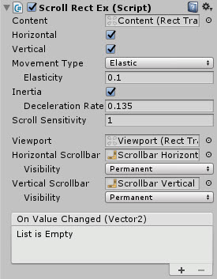
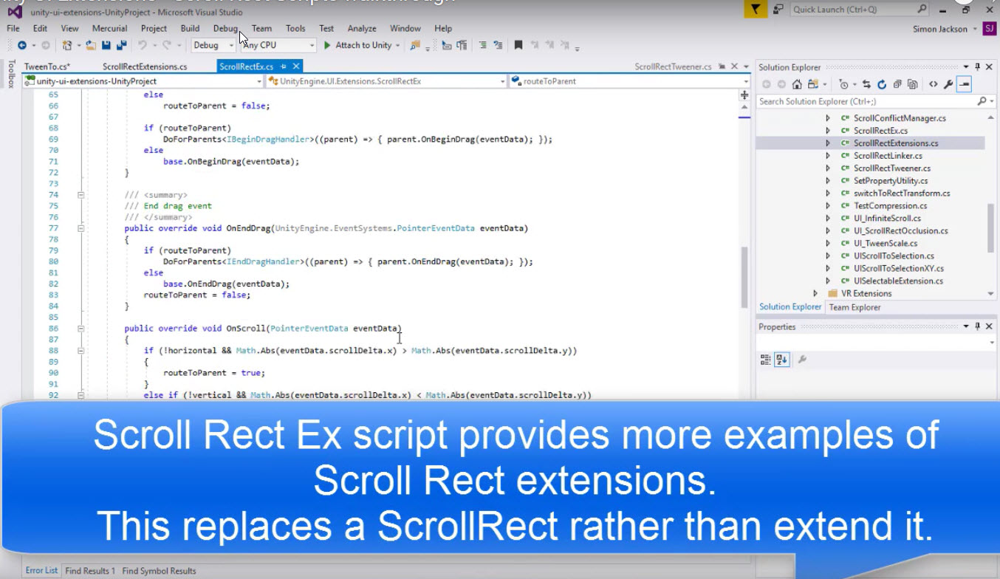

# Scroll Rect Ex

Improved Scroll Rect control, enables support for Nested Scroll Rects

<!---->

---------

## Contents

> 1 [Overview](#overview)
>
> 2 [Properties](#properties)
>
> 3 [Methods](#methods)
>
> 4 [Usage](#usage)
>
> 5 [Video Demo](#video-demo)
>
> 6 [See also](#see-also)
>
> 7 [Credits and Donation](#credits-and-donation)
>
> 8 [External links](#external-links)

---------

## Overview

The Scroll Rect Ex control is a replacement version of the standard Scroll Rect.
It's purpose is to solve the common issue when Scroll Rect's are nested which can prevent drag events from properly propagating from a child to a parent Scroll Rect.

---------

## Properties

### Inherited from ScrollRect

* All ScrollRect Properties

---------

## Usage

Simply replace the Scroll Rect script on a GameObject wit the Scroll Rect Ex version from "*UI / Extensions / Scroll Rect Ex*" in the "*Component*" menu.

It is also available as a Game Component menu in "*UI / Extensions / Scroll Rect Ex*".

---------

## Video Demo

*Click to play*

---------

## See also

* Unity (built-in) Scroll Rect Component
* Unity (built-in) Scroll View control

---------

## Credits and Donation

Credit [CaptainSchnittchen]()

---------

## External links

Sourced from - [http://forum.unity3d.com/threads/scripts-useful-4-6-scripts-collection.264161/page-2#post-2011648](http://forum.unity3d.com/threads/scripts-useful-4-6-scripts-collection.264161/page-2#post-2011648)
