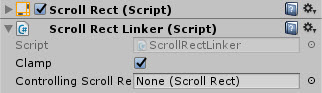
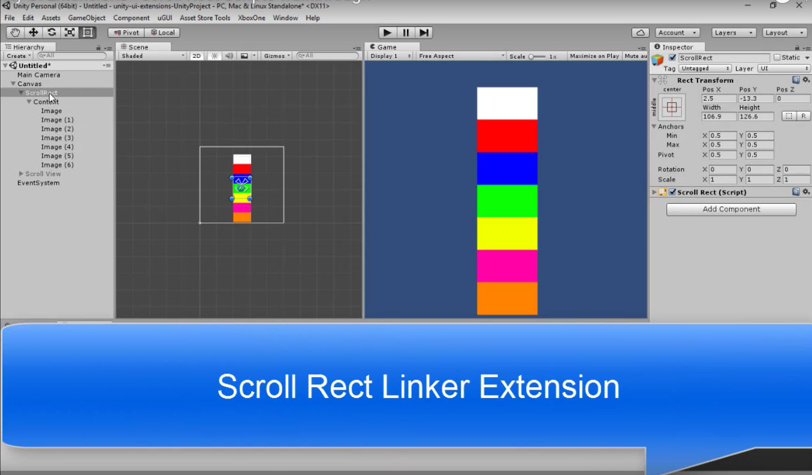

# ScrollRectLinker

ScrollRect Linker script, enable multiple Scroll Rects to move together

<!---->

---------

## Contents

> 1 [Overview](#overview)
>
> 2 [Properties](#properties)
>
> 3 [Methods](#methods)
>
> 4 [Usage](#usage)
>
> 5 [Video Demo](#video-demo)
>
> 6 [See also](#see-also)
>
> 7 [Credits and Donation](#credits-and-donation)
>
> 8 [External links](#external-links)

---------

## Overview

The Scroll Rect Linker script allows you to control another Scroll Rect's position from another Scroll Rect.

---------

## Properties

The properties of the Scroll Rect Linker control are as follows:

Property | Description
-|-
*Clamp*|Clamp the linked scroll values
*Controlling Scroll Rect*|The parent Scroll Rect to retrieve scrolling changes from.

---------

## Methods

This component does not expose public methods beyond inherited behaviour.

---------

## Usage

Simply add the default Scroll Rect Linker component to a Scroll Rect using:

"Add Component -> UI -> Extensions -> ScrollRectLinker"

Then drag the parent Scroll Rect to the appropriate property.

---------

## Video Demo

*Click to play*

---------

## See also

* [Scroll Rect Infinite](/Controls/UI_InfiniteScroll.md)
* [Scroll Rect Occlusion](/Controls/UI_ScrollRectOcclusion.md)
* [Scroll Rect Tweener](/Controls/ScrollRectTweener.md)
* [Scroll Rect Conflict Manager](/Controls/ScrollConflictManager.md)

---------

## Credits and Donation

Credit [Martin Sharkbomb ]()

---------

## External links

Sourced from - [http://www.sharkbombs.com/2015/08/26/unity-ui-scrollrect-tools/](http://www.sharkbombs.com/2015/08/26/unity-ui-scrollrect-tools/)
