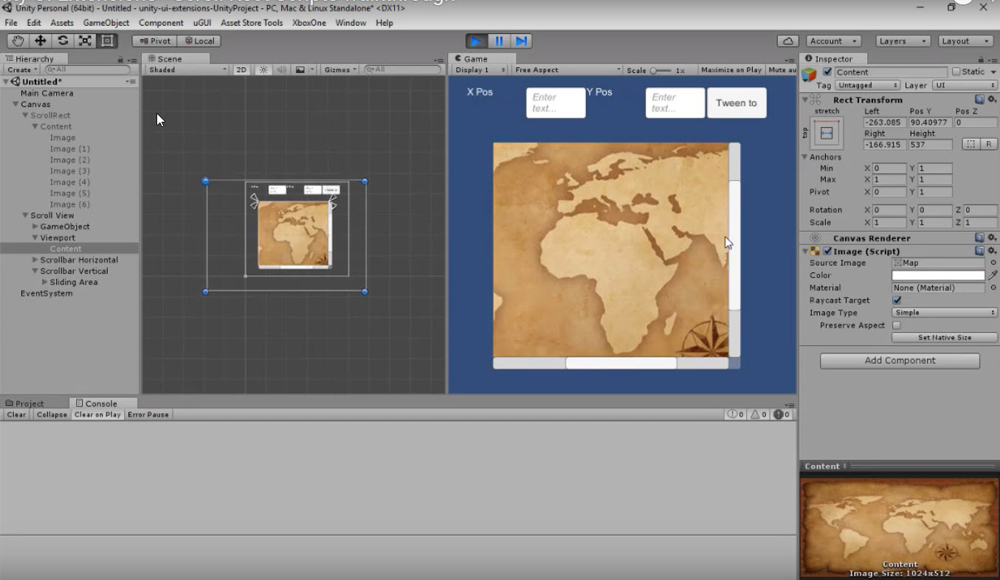

# Scroll Rect Tweener

Tweening solution for ScrollRects, adds smoothing automatically

<!---->

---------

## Contents

> 1 [Overview](#overview)
>
> 2 [Properties](#properties)
>
> 3 [Methods](#methods)
>
> 4 [Usage](#usage)
>
> 5 [Video Demo](#video-demo)
>
> 6 [See also](#see-also)
>
> 7 [Credits and Donation](#credits-and-donation)
>
> 8 [External links](#external-links)

---------

## Overview

The Scroll Rect Tweener is a simple programmatic component that allows you tween from one position on a Scroll Rect to another with a selectable smoothing value

---------

## Properties

The properties of the Box Slider control are as follows:

Property | Description
|-|-|
*Move Speed*|The default speed that the control moves when Tweening
*Disable Drag While Tweening*|Stops the user from being able to disrupt the tweening motion via touch or pointer

The control is mainly used programmatically with the following functions
Function | Arguments | Description
|-|-|-|
*ScrollHorizontal*| float (X Value)|X Coordinate to tween to horizontally
*ScrollHorizontal*| float (X Value), float (duration)|X Coordinate to tween to horizontally overriding the default Tween duration
*ScrollVertical*| float (Y Value)|Y Coordinate to tween to vertically
*ScrollVertical*| float (Y Value), float (duration)|Y Coordinate to tween to vertically overriding the default Tween duration
*Scroll*| Vector2 (2D position)|Tween to the provided X / Y coordinates on the Scroll Rect
*Scroll*| Vector2 (2D position), float (duration)|Tween to the provided X / Y coordinates on the Scroll Rect overriding the default Tween duration

**Note**
Coordinates are quad based with 0,0 being the bottom left and 1,1 being the top right of the Scroll Rect Area.

---------

## Usage

Simply add the default Scroll Rect Tweener component to a Scroll Rect using "*UI / Extensions / Scroll Rect Tweener*" in the "*Component*" menu.

It is also available as a Game Component menu in "*UI / Extensions / Scroll Rect Tweener*".

---------

## Video Demo

*Click to play*

---------

## See also

* [Scroll Rect Infinite](/Controls/UI_InfiniteScroll.md)
* [Scroll Rect Occlusion](/Controls/UI_ScrollRectOcclusion.md)
* [Scroll Rect Linker](/Controls/ScrollRectLinker.md)
* [Scroll Rect Conflict Manager](/Controls/ScrollConflictManager.md)

---------

## Credits and Donation

Credit [Martin Sharkbomb ]()

---------

## External links

Sourced from - [http://www.sharkbombs.com/2015/08/26/unity-ui-scrollrect-tools/](http://www.sharkbombs.com/2015/08/26/unity-ui-scrollrect-tools/)
