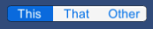
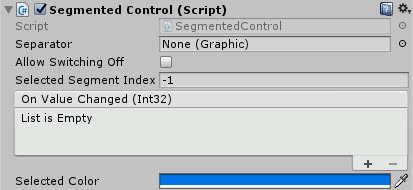
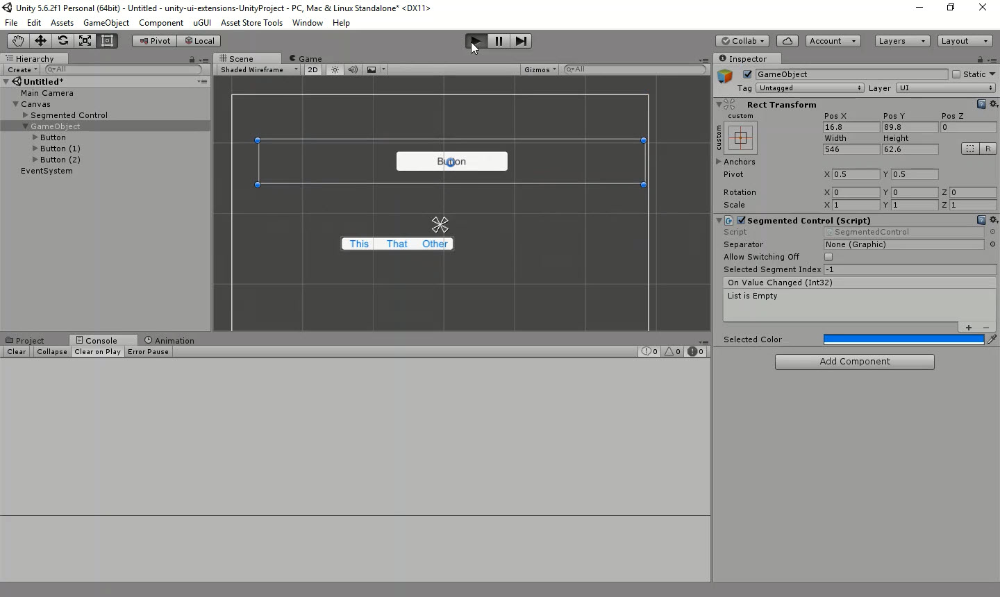

# Segmented Control

A segmented control, like those found on iOS. It's two or more buttons side by side, where only one of them is selectable at a time

---------

## Contents

> 1 [Overview](#overview)
>
> 2 [Properties](#properties)
>
> 3 [Methods](#methods)
>
> 4 [Usage](#usage)
>
> 5 [Video Demo](#video-demo)
>
> 6 [See also](#see-also)
>
> 7 [Credits and Donation](#credits-and-donation)
>
> 8 [External links](#external-links)

---------

## Overview

The Segmented Control offers a button alignment capability along with specific highlights that emulates the iOS version of a segmented button.  The control presented itself as a single image with multiple options, where only one can be selected.

It allows you to set whether buttons can be turned on/off, or only one selected at a time, as well as setting the default select and the colour the button is highlighted with when clicked..

Like the [Stepper Control](/Controls.md/Stepper), you can also specify a Separator image attached to a GO to place between the buttons.

---------

## Properties

The properties of the Segmented Control are as follows:

Property | Description
|-|-|
*Separator*|A graphic based UI GO, which will serve as the image that separates each button. *Note, you should disable the GO used for the separator or use a prefab to avoid dirtying the scene.
*Allow Switching Off*|When set, buttons can be clicked but not unselected, only selecting a new option will clear the selection
*Selected Segment Index*|Zero based index which choses the selected default. This defaults to -1 which denotes no option selected
*On Value Changed* (event) |The Event fired when the selection within the control changes, passing the index of the selected button
*Selected Color*|The highlighted color of the button when an option is selected

---------

## Usage

Simply add the default Segmented Control to the scene using "*UI / Extensions / Segmented Control*" in the Editor "*GameObject*" menu.

It is also available as a Game Component menu in "*UI / Extensions / Segmented Control*". However, you will need to manually Add buttons as children to the GO for the options.

---------

## Video Demo

*Click to play*

---------

## See also

* [Stepper Control](/Controls.md/Stepper)

---------

## Credits and Donation

Credit [David Gileadi](https://bitbucket.org/david_gileadi/)

---------

## External links

Sourced from - [https://bitbucket.org/UnityUIExtensions/unity-ui-extensions/pull-requests/12/segmented-control/diff](https://bitbucket.org/UnityUIExtensions/unity-ui-extensions/pull-requests/12/segmented-control/diff)
