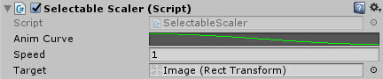
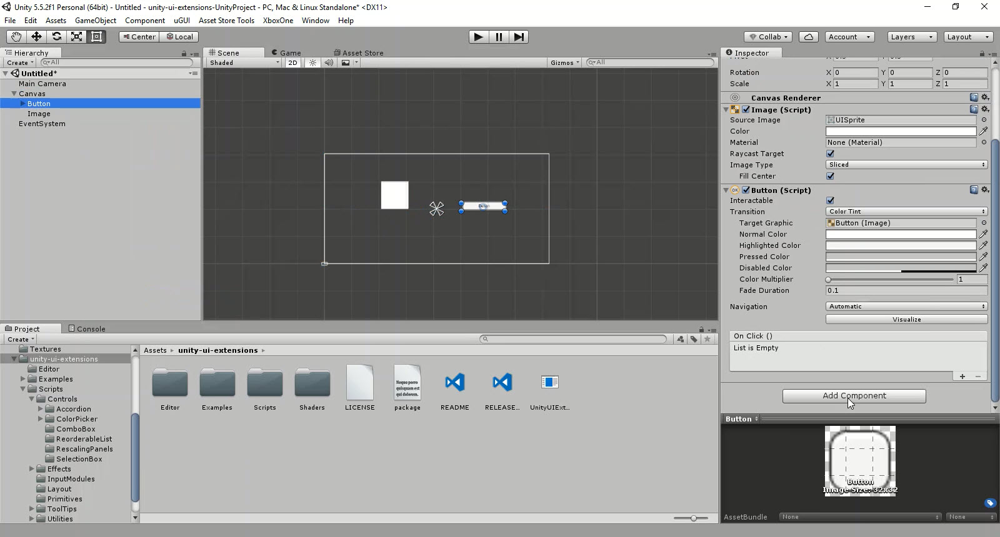

# Selectable Scalar

A simple tween scaler to affect Rect Transform scale on other controls.

<!---->

---------

## Contents

> 1 [Overview](#overview)
>
> 2 [Properties](#properties)
>
> 3 [Methods](#methods)
>
> 4 [Usage](#usage)
>
> 5 [Video Demo](#video-demo)
>
> 6 [See also](#see-also)
>
> 7 [Credits and Donation](#credits-and-donation)
>
> 8 [External links](#external-links)

---------

## Overview

A simple Tween enhancement that scales another RectTransform according to a preset curve.

---------

## Properties

The properties of the Selectable Scalar control are as follows:

Property | Description
|-|-|
*Anim Curve*|The curve that will be used to scale the Rect Transform in and out.
*Speed*|The speed at which the animation will take effect.
*Target*|The target for the animation.

---------

## Usage

Like with other Layout controls, simply add this control to any control that has a *Selectable* component (e.g. Button, NonGraphicSelectable) through the Add Component menu as follows:
"Add Component -> Extensions -> Selectable Scalar*"

Or alternatively, add the component to the control using:

"*Component -> UI -> Extensions -> Selectable Scalar*"

---------

## Video Demo

*Click to play*

---------

## See also

* [UI_TweenScale](/Controls.md/UI_TweenScale)

---------

## Credits and Donation

Tomek S

---------

## External links

[Sourced from](https://pastebin.com/NXYu37jC)
