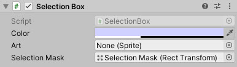
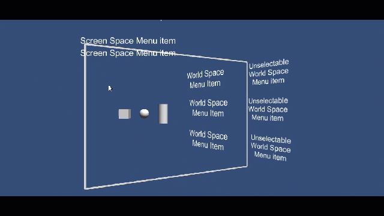

# SelectionBox

An RTS style selection box control

<!---->

---------

## Contents

> 1 [Overview](#overview)
>
> 2 [Properties](#properties)
>
> 3 [Methods](#methods)
>
> 4 [Usage](#usage)
>
> 5 [Video Demo](#video-demo)
>
> 6 [See also](#see-also)
>
> 7 [Credits and Donation](#credits-and-donation)
>
> 8 [External links](#external-links)

---------

## Overview

A selection box control to enable selecting 2D and 3D content within a Canvas / selectable area

---------

## Properties

The properties of the Selectable Scalar control are as follows:

Property | Description
-|-
*Color*|The color to apply to the selectable.
*Art*|The texture to draw as the background to the selectable area.
*Selection Mask*|The Rect Transform for the area that allows items to be selectable, restricts object being selected.

---------

## Methods

This component does not expose public methods beyond inherited behaviour.

---------

## Usage

Add the Selection Box to the scene using:

"*GameObject -> UI -> Extensions -> Selection Box*"

Alternatively, add the component to an existing GameObject using:

"*Add Component -> UI -> Extensions -> Selection Box*"

Once setup, define a separate Rect Transform to specify the area of the screen that should be selectable. Any objects contained within the Selection mask will be selectable.

Additionally, you can customize the graphic used for the "Selection Box" that is drawn using the Art property.

---------

## Video Demo

---------

## See also

N/A

---------

## Credits and Donation

* Korindian
* BenZed

---------

## External links

N/A
