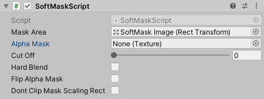
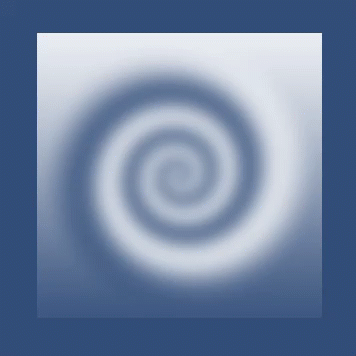

# SoftAlphaMask

Shader based mask able to clip images using an alpha mask

<!---->

---------

## Contents

> 1 [Overview](#overview)
>
> 2 [Properties](#properties)
>
> 3 [Methods](#methods)
>
> 4 [Usage](#usage)
>
> 5 [Video Demo](#video-demo)
>
> 6 [See also](#see-also)
>
> 7 [Credits and Donation](#credits-and-donation)
>
> 8 [External links](#external-links)

---------

## Overview

Where most Alpha Mask effects built into the Unity UI system work on hard transparencies, the Soft Alpha Mask is able to work with alpha mask gradients and includes animation features to enable a smooth transition.

---------

## Properties

The properties of the Selectable Scalar control are as follows:

Property | Description
-|-
*Mask Area*|The area that is to be used as the container.
*Alpha Mask*|Texture to be used to do the soft alpha.
*Cut Off*|At what point to apply the alpha min range 0-1.
*Hard Blend*|Implement a hard blend based on the Cutoff.
*Flip Alpha Mask*|Flip the masks alpha value.
*Don't clip Mask Scaling Rect*|If a different Mask Scaling Rect is given, and this value is true, the area around the mask will not be clipped.

---------

## Methods

This component does not expose public methods beyond inherited behaviour.

---------

## Usage

Simply add the "Soft Mask Script" component to an existing UI object and apply a "Mask" texture.  Alter the "Cut Off" value to scale out the masking effect.

There is also a Text version of the Soft Alpha Mask to work with Text Objects.

---------

## Video Demo

---------

## See also

N/A

---------

## Credits and Donation

Charles Humphrey (@NemoKrad)

---------

## External links

[https://www.youtube.com/watch?v=JVds9P9J_hU](https://www.youtube.com/watch?v=JVds9P9J_hU)
