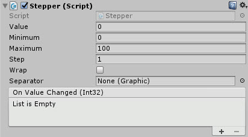
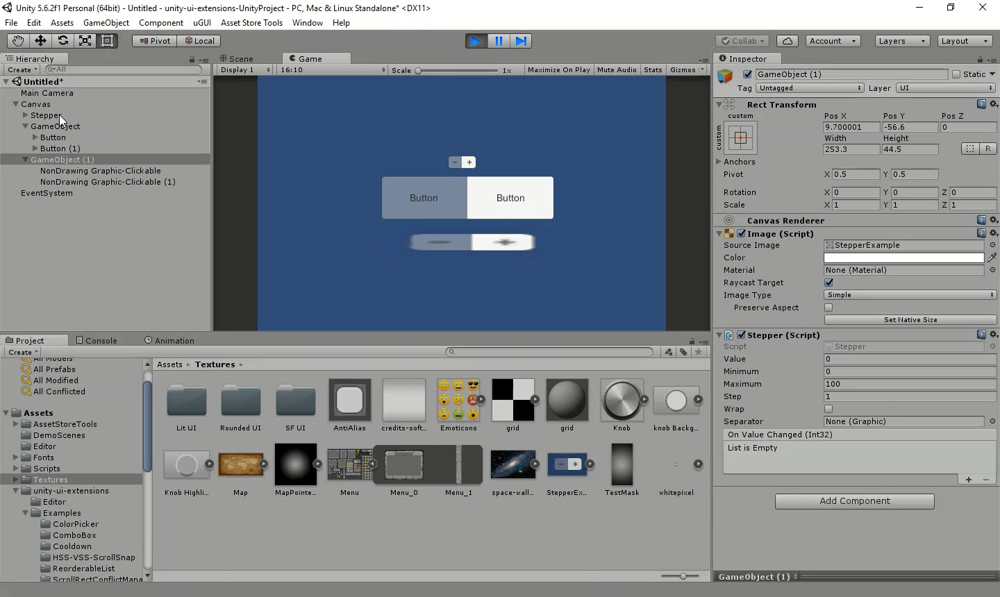

# Stepper

A stepper control, like those found in iOS. It's basically two buttons side by side, and can step its numeric value up and down.

<!---->

---------

## Contents

> 1 [Overview](#overview)
>
> 2 [Properties](#properties)
>
> 3 [Methods](#methods)
>
> 4 [Usage](#usage)
>
> 5 [Video Demo](#video-demo)
>
> 6 [See also](#see-also)
>
> 7 [Credits and Donation](#credits-and-donation)
>
> 8 [External links](#external-links)

---------

## Overview

The Stepper Control creates an increment / decrement style control with + and - buttons which alter the controls value.

It exposes a value property where you can also set a min and maximum number for that value when changed through the control.  Additionally you can also specify the "step" which denotes how much the control increments / decrements with each press, as well as an option to loop the value around from top to bottom, etc.

Like the [Segmented Control](/Controls/SegmentedControl.md), you can also specify a Separator image attached to a GO to place between the buttons.

> [!NOTE]
> You can only have two child buttons attached to the Stepper, one each for the + and - actions.  Adding more will generate an error.

---------

## Properties

The properties of the Stepper Control control are as follows:

Property | Description
-|-
*Value*|The current value of the Stepper control
*Minimum*|The minimum value for the Stepper
*Maximum*|The maximum value for the Stepper
*Step*|The number to increment / decrement the control with when the buttons are clicked
*Wrap*|Does the value of the stepper wrap around when the max/min is reached
*Separator*|A graphic based UI GO, which will serve as the image that separates each button. *Note, you should disable the GO used for the separator or use a prefab to avoid dirtying the scene.
***On Value Changed*** (event)|The Event fired when the value of the control is changed

---------

## Methods

This component does not expose public methods beyond inherited behaviour.

---------

## Usage

Simply add the default Stepper to the scene using:

"*GameObject -> UI -> Extensions -> Sliders -> Stepper*"

It is also available as a Game Component menu:

"*Add Component -> UI -> Extensions -> Sliders -> Stepper*"

However, you will need to manually add the two child selectable controls (e.g. A UI Button or other control implementing the "Selectable" interface).

---------

## Video Demo

*Click to play*

---------

## See also

* [Segmented Control](/Controls/SegmentedControl.md)

---------

## Credits and Donation

Credit [David Gileadi](https://bitbucket.org/david_gileadi/)

---------

## External links

Sourced from - [https://bitbucket.org/UnityUIExtensions/unity-ui-extensions/pull-requests/11/segmented-control/diff](https://bitbucket.org/UnityUIExtensions/unity-ui-extensions/pull-requests/11/segmented-control/diff)
