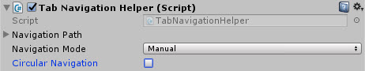
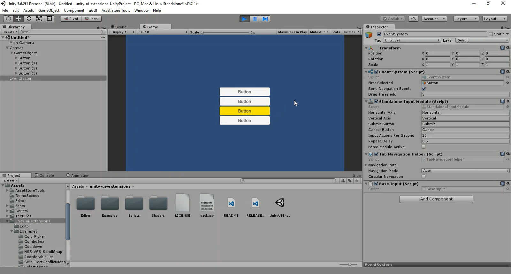

# Tab Navigation

An example Tab navigation script, updated to add manual navigation

<!---->

---------

## Contents

> 1 [Overview](#overview)
>
> 2 [Properties](#properties)
>
> 3 [Methods](#methods)
>
> 4 [Usage](#usage)
>
> 5 [Video Demo](#video-demo)
>
> 6 [See also](#see-also)
>
> 7 [Credits and Donation](#credits-and-donation)
>
> 8 [External links](#external-links)

---------

## Overview

The Tab navigation helper is an extension to the Unity Event System to translate Tab's to default Up/Down navigation of the UI system

You can either use Unity's default UI Navigation or you can override it by setting your own tab order in the "Navigation Path" property.

The control has also been extended to allow for circular navigation, so tabs will continue past the last option.

---------

## Properties

The properties of the Tab Navigation Helper control are as follows:

Property | Description
|-|-|
*Navigation Path*|The manual order for the Tab Navigation script
*Navigation Mode*|Use Unity's automatic control order or override it with a manual order with *Navigation Path*
*Circular Navigation*|Does the tab order from from start to finish, or loop round once the end is reached

---------

## Usage

Simply add the default Tab Navigation Helper component to the EventSystem in the scene using "*Event / Extensions / Tab Navigation*" in the Game Object Component menu.

> Do not add it to an existing control, either add it to the Event System added by Unity, or create an Empty GO and add it there (The Event System will be automatically added)

---------

## Video Demo

*Click to play*

---------

## See also

N/A

---------

## Credits and Donation

* Melang

---------

## External links

[Sourced from](http://forum.unity3d.com/members/melang.593409/)
