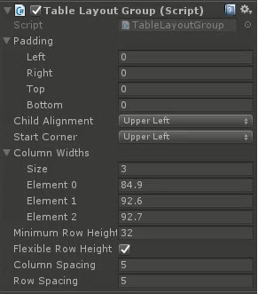

# TableLayoutGroup

A table layout system supporting customizable column and row sizes / layout

<!---->

---------

## Contents

> 1 [Overview](#overview)
>
> 2 [Properties](#properties)
>
> 3 [Methods](#methods)
>
> 4 [Usage](#usage)
>
> 5 [Video Demo](#video-demo)
>
> 6 [See also](#see-also)
>
> 7 [Credits and Donation](#credits-and-donation)
>
> 8 [External links](#external-links)

---------

## Overview

The table layout group allows the layout of child items in to the style of a table.  You can specify how many columns should be supported as well as the size of columns and rows.
Additionally, you can specify padding between the columns and rows.

If you wish you can override the fixed row height to allow child elements to set their height.

This control differs to the built in Unity Grid layout, which can only arrange items dynamically in a grid based on the size of the containing RectTransform.

---------

## Properties

The properties of the Box Slider control are as follows:

Property | Description
-|-
*Start Corner*|The corner to start adding children from
*Column Widths*|An array of floats to denote the width of each column. Content sized to fit
*Minimum Row Height*|The minimum height of child items in a row
*Flexible Row Height*|Are flexible row heights allowed, or should they be fixed to the minimum
*Column Spacing*|The amount of space between each column
*Row Spacing*|The amount of space between each row

### Inherited from built-in layoutGroup

* Padding (sets the padding inside the RectTransform before drawing children)
* Child Alignment

---------

## Methods

This component does not expose public methods beyond inherited behaviour.

---------

## Usage

Create an Empty GO on a Canvas and add the **Table Layout Group** component using:

"*Add Component -> Layout -> Extensions -> Table Layout Group*"

---------

## Video Demo

*Click to play*

---------

## See also

* Unity (built-in) Grid Layout
* [Curved Layout](/Controls/CurvedLayout.md)
* [Flow Layout Group](/Controls/FlowLayoutGroup.md)
* [Radial Layout](/Controls/RadialLayout.md)

---------

## Credits and Donation

Credit [RahulOfTheRamanEffect](https://forum.unity3d.com/members/judah4.34568/)

---------

## External links

Sourced from - [https://bitbucket.org/UnityUIExtensions/unity-ui-extensions/pull-requests/36](https://bitbucket.org/UnityUIExtensions/unity-ui-extensions/pull-requests/36)
