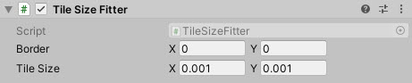

# TileSizeFitter

A fitter layout that will shrink / expand content by tiles

<!---->

---------

## Contents

> 1 [Overview](#overview)
>
> 2 [Properties](#properties)
>
> 3 [Methods](#methods)
>
> 4 [Usage](#usage)
>
> 5 [Video Demo](#video-demo)
>
> 6 [See also](#see-also)
>
> 7 [Credits and Donation](#credits-and-donation)
>
> 8 [External links](#external-links)

---------

## Overview

The Tile Size Fitter will automatically rescale an image within a RectTransform according to the defined Size and border settings.

---------

## Properties

The properties of the TileSizeFitter control are as follows:

Property | Description
|-|-|
*Border*|The border spacing around the image
*Tile Size*|The boundaries at which the selected image will resize

---------

## Usage

Simply add the "TileSizeFitter" component to an existing Image component in the scene using:

* "*Layout / Extensions / Tile Size Fitter*" in the Editor "*Component*" menu.

---------

## Video Demo

"Link to demo video or animated Gifs"

---------

## See also

N/A

---------

## Credits and Donation

Ges

---------

## External links

* [Sourced from](http://forum.unity3d.com/threads/scripts-useful-4-6-scripts-collection.264161/page-3#post-2280109)
