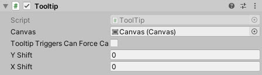

# ToolTip

An basic Tooltip implementation

<!---->

---------

## Contents

> 1 [Overview](#overview)
>
> 2 [Properties](#properties)
>
> 3 [Methods](#methods)
>
> 4 [Usage](#usage)
>
> 5 [Video Demo](#video-demo)
>
> 6 [See also](#see-also)
>
> 7 [Credits and Donation](#credits-and-donation)
>
> 8 [External links](#external-links)

---------

## Overview

A tooltip implementation which allows the user to hover over a RectTransform to activate it.

---------

## Properties

The properties of the Tooltip control are as follows:

Property | Description
-|-
*Canvas*|The canvas used by the tooltip as positioning and scaling reference. Should usually be the root Canvas of the hierarchy this component is in.
*TooltipTriggersCanForceCanvasUpdate*|Sets if tooltip triggers will run ForceUpdateCanvases and refresh the tooltip's layout group, (if any) when hovered, in order to prevent momentousness misplacement sometimes caused by ContentSizeFitters.
*Y Shift*|Offset positioning of the Tooltip on the Y axis
*X Shift*|Offset positioning of the Tooltip on the X axis
-|-
Instance|Programmatically find the single instance of the ToolTip definition in the scene

---------

## Methods

Method | Arguments | Description
-|-|-
*SetTooltip*|Text (string)|Activates the Tooltip in its current location
*SetTooltip*|Text (string), Position (Vector3), RefreshCanvasBeforeGetSize (bool)|Activates the Tooltip at the specified location. Optionally, force a canvas refresh before presenting.
*HideTooltip*|N/A|Hides the Tooltip
*RefreshTooltipSize*|N/A|Forces a Canvas refresh to update the Tooltips content size fitter, if applied.
*ContextualTooltipUpdate*|RefreshCanvasBeforeGetSize (bool)|Runs the appropriate tooltip placement method, according to the parent canvas's render mode.
*OnScreenSpaceCamera*|RefreshCanvasBeforeGetSize (bool)|Forces drawing the tooltip based on a ScreenSpace Canvas
*OnScreenSpaceOverlay*|RefreshCanvasBeforeGetSize (bool)|Forces drawing the tooltip based on a ScreenSpace Overlay Canvas

---------

## Usage

Add the ToolTip control to a GameObject using:

"Add Component -> UI -> Extensions -> Tooltip -> Tooltip"

Or alternatively, add it via the GameObject menu:

"GameObject -> UI -> Extensions -> Tooltip"

A Text component should also be added to a Child GameObject, for displaying the Tooltip Text.
Once setup, design the look and feel of the tooltip as required, the tooltip will appear in the desired position once called.

---------

## Video Demo

N/A

---------

## See also

* [HoverToolTip](/Controls/HoverToolTip.md)
* [BoundToolTip](/Controls/BoundToolTip.md)

---------

## Credits and Donation

* drHogan

---------

## External links

[Sourced from](http://forum.unity3d.com/threads/screenspace-camera-tooltip-controller-sweat-and-tears.293991/#post-1938929)
