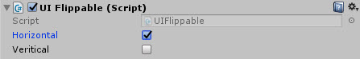
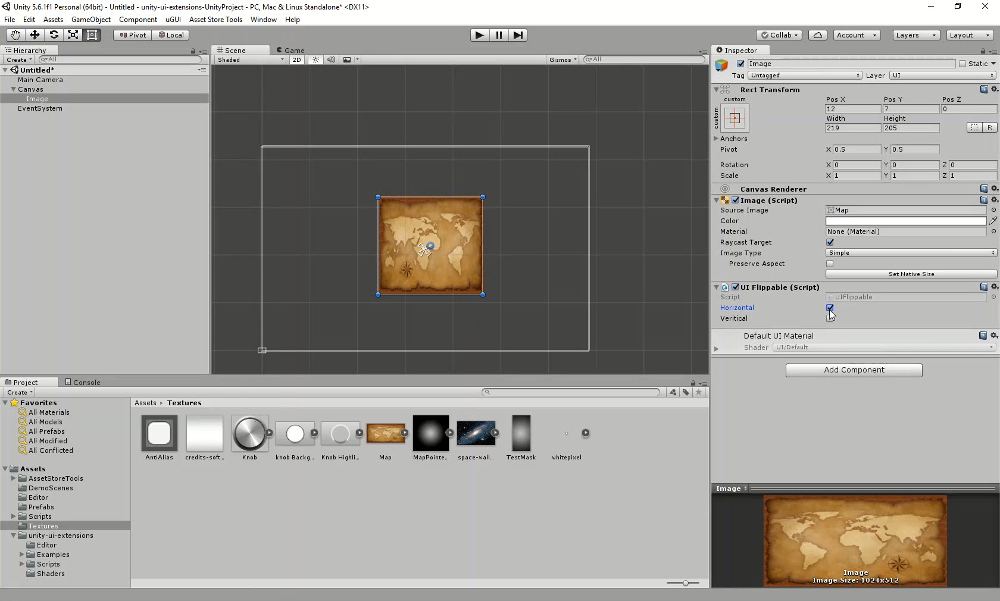

# UIFlippable

A Graphic altering tool which can flip a graphic either Horizontally / Vertically or both.

<!---->

---------

## Contents

> 1 [Overview](#overview)
>
> 2 [Properties](#properties)
>
> 3 [Methods](#methods)
>
> 4 [Usage](#usage)
>
> 5 [Video Demo](#video-demo)
>
> 6 [See also](#see-also)
>
> 7 [Credits and Donation](#credits-and-donation)
>
> 8 [External links](#external-links)

---------

## Overview

The Flippable effect allows you to flip a graphic either on the Horizontal axis, vertical axis or both through this simple component..

*Note* when used with other graphical effects, this component must be ordered the highest, else Unity will report an error. (see usage)

---------

## Properties

The properties of the UI Flippable component are as follows:

Property | Description
-|-
*Horizontal*|Flip the graphic horizontally
*Vertical*|Flip the graphic vertically

---------

## Methods

This component does not expose public methods beyond inherited behaviour.

---------

## Usage

Available as a Game Component menu:

"*Add Component -> UI -> Effects -> Extensions -> Flippable*"

Or add to the scene using:

"*GameObject -> UI -> Extensions -> Controls -> UI Flippable*"

Simple add to any Image or Graphic Component.

> [!NOTE]
> Unity has changed it's behaviour about stacking multiple BaseMeshEffects, if the effect alters vertices then the component must be ordered at the top of the components.  
> E.G. UIFlippable must be ordered above OutLine / NicerOutline etc.
> The control will automatically do this when added to a GameObject, but if you reorder it you may get a NullReferenceException.  To fix, either reorder or touch any property.

---------

## Video Demo

*Click to play*

---------

## See also

N/A

---------

## Credits and Donation

Credit ChoMPHi

---------

## External links

Sourced from - [http://forum.unity3d.com/threads/script-flippable-for-ui-graphics.291711/](http://forum.unity3d.com/threads/script-flippable-for-ui-graphics.291711/)
