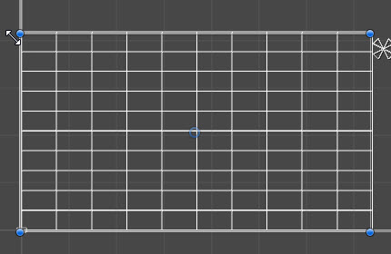
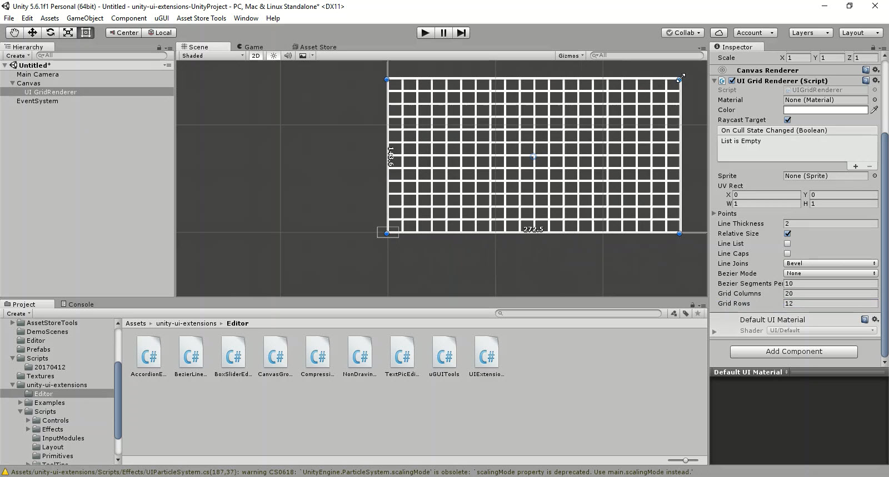

# UI Grid Renderer

A primitive line drawing control that draws a Grid within a RectTransform space

---------

## Contents

> 1 [Overview](#overview)
>
> 2 [Properties](#properties)
>
> 3 [Methods](#methods)
>
> 4 [Usage](#usage)
>
> 5 [Video Demo](#video-demo)
>
> 6 [See also](#see-also)
>
> 7 [Credits and Donation](#credits-and-donation)
>
> 8 [External links](#external-links)

---------

## Overview

The Grid Renderer control draws a box area with a defined Grid inside, allowing control of the columns and rows within.
This control extend the base UI Line Renderer control and inherits some of it's features, not all of which are useful for a grid.

The main configuration is the GridColumns and GridRows to determine how many cells there are.  

> [!NOTE]
> The grid is only a renderer, it does not layout any child controls with in it.  Consider pairing up with a the GridLayout control if you want to align children as well.

---------

## Properties

The properties of the Box Slider control are as follows:

Property | Description
-|-
*Points*|Array of points to draw the line between (Min 2).  *Read only for GridRenderer as it controls this*
*Line Thickness*|The thickness of the drawn line.
*Use Margins*|Apply margin values to control, shrinking the drawable space within the Rect Transform.
*Margin*|Margin values to be applied on the X and Y axis when applied with "Use Margins". *Fixed to Yes for the GridRenderer*
*Relative Size*|Draw the line relative (within) the Rect Transform or use absolute Screen space coordinates.
*Line List*|Points array becomes a set of matched pairs, so lines are only drawn in pairs instead of a single consistent line.
*Line Caps*|Add end caps to the draw lines.
*Line Joins*|Determines whether joins are curved (Bevel) or hard edges (Miter)
*Bezier Mode*|Draws bezier curves between groups of 4 lines. Several modes are available with increasing quality but require more calculations
*Bezier Segments Per Curve*|Allows you to set how many segments make up the Bezier curve, more points equal a smoother curve more more lines to draw.
*Grid Columns*|Defines the number of columns within the Grid
*Grid Rows*|Defines the number of rows within the Grid

### Inherited from Maskable Graphic

* Material
* Color
* Raycast Target
* On Cull State Changed
* Sprite
* UV Rect

---------

## Methods

This component does not expose public methods beyond inherited behaviour.

---------

## Usage

Simply add the default UI Grid Renderer control to the scene using:

"*GameObject -> UI -> Extensions -> Primitives -> UI Grid Renderer*"

Alternatively, add the component using:

"*Add Component -> UI -> Extensions -> Primitives -> UIGridRenderer*"

---------

## Video Demo

*Click to play*

---------

## See also

* [UILineRenderer](/Controls/UILineRenderer.md)
* [UILineTextureRenderer](/Controls/UILineTextureRenderer.md)

---------

## Credits and Donation

Credit [John Hattan](http://thecodezone.com/)

---------

## External links

Sourced from - [https://bitbucket.org/UnityUIExtensions/unity-ui-extensions/issues/117/uigridrenderer](https://bitbucket.org/UnityUIExtensions/unity-ui-extensions/issues/117/uigridrenderer)
