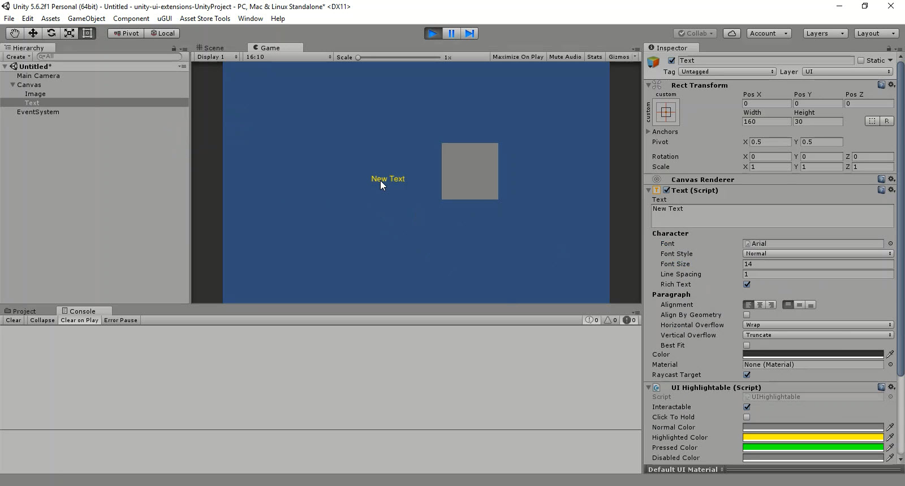

# UI Highlightable

A custom component to enable RectTransform highlighting without the Unity UI Selectable control.  Useful if you want to extend your own controls.

<!---->

---------

## Contents

> 1 [Overview](#overview)
>
> 2 [Properties](#properties)
>
> 3 [Methods](#methods)
>
> 4 [Usage](#usage)
>
> 5 [Video Demo](#video-demo)
>
> 6 [See also](#see-also)
>
> 7 [Credits and Donation](#credits-and-donation)
>
> 8 [External links](#external-links)

---------

## Overview

The UI selectable added highlighting behavior to a RectTransform without needing a Selectable component. The selectable control by default, has certain behaviors like click-sticking (where the control is clicked and remains in the highlighted state until something else is clicked) which may not be desirable.
This control offers more control and some additional behaviour, such as "Click to hold" which leaves a RectTransform in the clicked state until it is clicked again (like a toggle)

The control also supports a disabled state but has no control over child Rect Transforms, so an event was added to allow you to perform additional actions when the the RectTransform is rendered inactive.

---------

## Properties

The properties of the UI Highlightable control are as follows:

Property | Description
|-|-|
*Interactable*|Does the control react to highlighted events?  Defaults to the Disabled color.
*Click to Hold*|When clicked, does the control stay in the Pressed Color or return to the highlighted color (default, pressed color only use when clicked or held)
*Normal Color*|The default color of the RectTransform when not being interacted with
*Highlighted Color*|The color of the RectTransform when the mouse is over it or the control is in focus
*Pressed Color*|The color of the RectTransform when clicked or held
*Disabled Color*|The color of the RectTransform when it is non-interactable (see *Interactable*)
*On Interactable Changed* (event) |The Event fired when the the control enters and leaves the Interactable State, passes the current state when fired.

### Implements the Image control on the RectTransform

---------

## Usage

> Can only be placed on a RectTransform that has a Graphic attached, e.g. an Image, RawImage or Text.

Simply add the UI Highlightable component to a RectTransform using the Component menu, it can be found in "*UI / Extensions / UI Highlightable*".

---------

## Video Demo

*Click to play*

---------

## See also

* [UI Selectable](/Controls/UISelectableExtension.md)

---------

## Credits and Donation

Credit SimonDarksideJ

---------

## External links

Sourced from - Issue proposal #153
