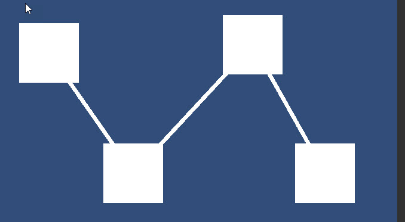

# UILineConnector

A Line Renderer helper used to draw a chain between multiple gameObjects, like a node connector

<!---->

---------

## Contents

> 1 [Overview](#overview)
>
> 2 [Properties](#properties)
>
> 3 [Methods](#methods)
>
> 4 [Usage](#usage)
>
> 5 [Video Demo](#video-demo)
>
> 6 [See also](#see-also)
>
> 7 [Credits and Donation](#credits-and-donation)
>
> 8 [External links](#external-links)

---------

## Overview

The UI Line Connector, allows you Override the Line Renderer control to build a line connecting the selected GameObjects.

This produces a Node connector style effect between the provided UI GameObjects.

> Depends on the [UI Line Renderer](/Controls/UILineRenderer.md) component

*Note*
The Lines depend on the Pivot's of the Main Canvas, Line Renderer and the Selected GameObjects.  Adjust as required.
---------

## Properties

The properties of the UILineConnector control are as follows:

Property | Description
|-|-|
*Transforms*|The List of GameObjects to connect lines between

### Requires Line Renderer Component

---------

## Usage

The UILineConnector is available as a Game Component menu in "*UI / Extensions / UI Line Connector*". This will also add the [UI Line Renderer](/Controls/UILineRenderer.md) component by default

---------

## Video Demo

*Click to play*

---------

## See also

* [UILineRenderer](/Controls/UILineRenderer.md)

---------

## Credits and Donation

Credit [Alastair Aitchison](https://bitbucket.org/alastaira/)

---------

## External links

Sourced from - [https://bitbucket.org/UnityUIExtensions/unity-ui-extensions/issues/123/uilinerenderer-issues-with-specifying
](https://bitbucket.org/UnityUIExtensions/unity-ui-extensions/issues/123/uilinerenderer-issues-with-specifying
)
