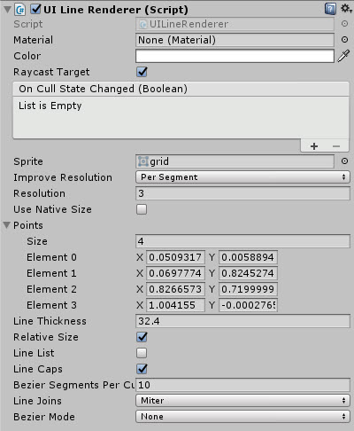

# UILineRenderer

Graphic control for drawing lines in the UI System

<!---->

---------

## Contents

> 1 [Overview](#overview)
>
> 2 [Properties](#properties)
>
> 3 [Methods](#methods)
>
> 4 [Usage](#usage)
>
> 5 [Video Demo](#video-demo)
>
> 6 [See also](#see-also)
>
> 7 [Credits and Donation](#credits-and-donation)
>
> 8 [External links](#external-links)

---------

## Overview

The UI Line Renderer allows you to draw distinct Line primitives between a collection of points on a Canvas.



Settings can be set either in the inspector or via script programmatically.

> Due to the way UI Rendering occurs, a UI LineRenderer component should ONLY be placed in their own child RectTransforms positioned at (0,0,0).  Having a UILineRenderer RectTransform at anything other than (0,0,0) will produce odd results as the offset from 0 is not handled.
>
> This includes any components that depend on the UILineRender, such as the UILineConnector.  These do not need to be included within objects they are drawing, as they handle rendering for the entire canvas.
>
> See the LineRenderer examples for clarity.

---------

## Properties

The properties of the Horizontal Scroll Snap control are as follows:

Property | Description
|-|-|
*Points*|Array of points to draw the line between (Min 2).
*Line Thickness*|The thickness of the drawn line.
*Use Margins*|Apply margin values to control, shrinking the drawable space within the Rect Transform.
*Margin*|Margin values to be applied on the X and Y axis when applied with "Use Margins".
*Relative Size*|Draw the line relative (within) the Rect Transform or use absolute Screen space coordinates.
*Line List*|Points array becomes a set of matched pairs, so lines are only drawn in pairs instead of a single consistent line.
*Line Caps*|Add end caps to the draw lines.
*Line Joins*|Determines whether joins are curved (Bevel) or hard edges (Miter)
*Bezier Mode*|Draws bezier curves between groups of 4 lines. Several modes are available with increasing quality but require more calculations
*Bezier Segments Per Curve*|Allows you to set how many segments make up the Bezier curve, more points equal a smoother curve more more lines to draw.

### Inherited from Primitive Base

Property | Description
|-|-|
*ResolutionMode*|Method for improving the resolution of a line, By Segment (Resoluton applied independently between points) or for the entire line (resolution distributed across the entire line)
*Resolution*|How many new points to automatically add between the Points list provided (note, will not draw if total points in a line exceeds 64k Vertices, Unity limit)
*Use Native Size*|Set's the UV drawing and resolution of the Line to use the native image size automatically

> Resolution options not 100% compatible with the Bezier functions of the Line Renderer. Best to test for the intended result. Simply because they both do the same thing for different reasons.

### Inherited from Maskable Graphic

* Material
* Color
* Raycast Target
* On Cull State Changed
* Sprite

---------

## Methods

Method | Arguments | Description
|-|-|-|
*GetPosition*|Index (int), SegmentIndex (int)|Get the Vector2 position of a line index
*GetPositionBySegment*|Index (int), SegmentIndex (int)|Get the Vector2 position of a line within a specific segment
*GetClosestPoint*|Starting Position (Vector2), End Position (Vector2), Desired Point (Vector2)|Get the closest point between two given Vector2s from a given Vector2 point

---------

## Usage

Simply add the default UI Line Renderer control to the scene using "*UI / Extensions / Primitives / UI Line Renderer*" in the Editor "*GameObject*" menu.

> Pivot point for all UI Lines should be 0,0.  Reset by new editor script.

It is also available as a Game Component menu in "*UI / Extensions / Primitives / UI Line Renderer*".

The control will automatically redraw it self by simply altering the points array through code or the editor as required.  An example script to update the point in code can be seen below:

```csharp
using System.Collections.Generic;
using UnityEngine;

public class AddingPoints : MonoBehaviour {

    public UnityEngine.UI.Extensions.UILineRenderer LineRenderer; // Assign Line Renderer in editor
    public UnityEngine.UI.Text XValue; // Test Input field to supply new X Value
    public UnityEngine.UI.Text YValue; // Test Input field to supply new Y Value

    // Use this for initialization
    public void AddNewPoint () {
        var point = new Vector2() { x = float.Parse(XValue.text), y = float.Parse(YValue.text) };
        var pointlist = new List<Vector2>(LineRenderer.Points);
        pointlist.Add(point);
        LineRenderer.Points = pointlist.ToArray();
    }
}
```

Project now includes an Editor script for easier manipulation of the points.  *Note* this will reset the Pivot point to 0,0 due to a limitation in Unity.

Line Render also now has improved Sprite support, including sprite slicing.  The Line will use the internal slice boundary for lines and the outer boundary will be used for Line caps.

---------

## Video Demo

[](http://www.youtube.com/watch?v=r69TW8uZAdU "Line Renderer walk-through video")

---------

## See also

* [UILineTextureRenderer](/Controls/UILineTextureRenderer.md)
* [UILineConnector](/Controls/UILineConnector.md)

---------

## Credits and Donation

jack.sydorenko, firagon

---------

## External links

* [Sourced from](http://forum.unity3d.com/threads/new-ui-and-line-drawing.253772/)
* [Updated/Refactored from](http://forum.unity3d.com/threads/new-ui-and-line-drawing.253772/#post-2528050)
