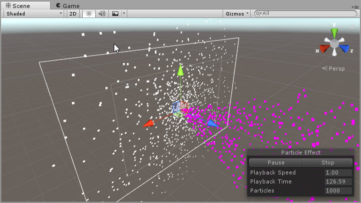

# UIParticleSystem

A particle system control to render the native Unity 3D particle system in UI Space

---------

## Contents

> 1 [Overview](#overview)
>
> 2 [Properties](#properties)
>
> 3 [Methods](#methods)
>
> 4 [Usage](#usage)
>
> 5 [Video Demo](#video-demo)
>
> 6 [See also](#see-also)
>
> 7 [Credits and Donation](#credits-and-donation)
>
> 8 [External links](#external-links)

---------

## Overview

The default Unity 3D Particle system doesn't generally work in the UI space.  It's possible to arrange the particle system between layers or fiddle around with WorldSpace canvases but the control isn't in your UI.  With this control, it takes the rendered output of a 3D Particle system and regenerates it in UI space (the actual rendering of the Particle system is disabled so that it doesn't cause a performance impact)

> [!NOTE]
>The control does not yet support Trail Particles currently
>
> **Update 2023** Personally, I would recommend [mob-sakai's ParticleEffectForUGUI](https://github.com/mob-sakai/ParticleEffectForUGUI) if this control is not meeting your expectations, as it has had further updates and also supports new features introduced in 2018.2.

---------

## Properties

The properties of the UI Particle System control are as follows:
**Requires Particle System**

Property | Description
-|-
*Material*|Particle render material - *Note* several shaders have been provided in the Shaders folder, all called UI.. (also in UI Extensions / Particles / ... in the shader browser)
*Color*|The color tint of the particles
*Fixed Time*|Should the particles render in fixed or game time

### Inherited from MaskableGraphic

* Raycast Target
* ***On Cull State Changed*** (event)

---------

## Methods

Method | Arguments | Description
-|-|-
*StartParticleEmission*|None|Starts the particle system if currently stopped
*StopParticleEmission*|None|Stops the particle system and clears the particle cache. Destroys current particles in scene from the emitter
*PauseParticleEmission*|None|Pauses the particle system emission, existing particles continue to travel

---------

## Usage

Simply add the UI Particle System component to a UI object using:

"*Add Component -> UI -> Effects -> Extensions -> UIParticleSystem*"

However, you will need to configure the particle system manually.

Alternatively, add a new Empty Game Object to a canvas, add the particle system and configure it how you like in the Scene view. Then add the "UIParticleSystem" component and scale your values to render correctly. If required, change the material to use one of the alternate shaders provided in the project in the "Shaders" folder or from "UI Extensions / Particles / ..." in the shader browser.

> [!NOTE]
> When you translate any 3D object to Canvas Space, it ALWAYS requires scaling up
>
> The control does not yet support Trail Particles currently

---------

## Video Demo

*Click to play*

---------

## See also

N/A

---------

## Credits and Donation

Credits:

* [glennpow](https://forum.unity3d.com/members/glennpow.87704/)
* [Zarlang](https://forum.unity3d.com/members/zarlang.87891/)

---------

## External links

Sourced from - [https://forum.unity3d.com/threads/free-script-particle-systems-in-ui-screen-space-overlay.406862](https://forum.unity3d.com/threads/free-script-particle-systems-in-ui-screen-space-overlay.406862)
