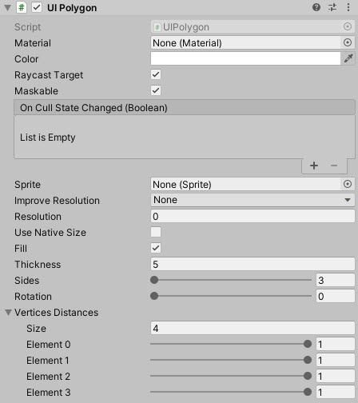
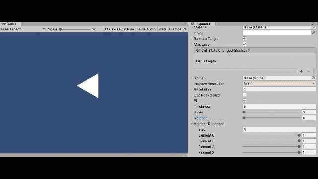

# UIPolygon

Graphic control for drawing custom polygons in the UI System

<!---->

---------

## Contents

> 1 [Overview](#overview)
>
> 2 [Properties](#properties)
>
> 3 [Methods](#methods)
>
> 4 [Usage](#usage)
>
> 5 [Video Demo](#video-demo)
>
> 6 [See also](#see-also)
>
> 7 [Credits and Donation](#credits-and-donation)
>
> 8 [External links](#external-links)

---------

## Overview

Advanced polygon control with support for multiple vertices which can be manipulated to control the look and feel of the primitive

---------

## Usage

Add the primitive control to your scene using:

* GameObject -> UI -> Extensions -> UI Polygon

---------

## Video Demo

---------

## See also

[DiamondGraph](/Controls.md/DiamondGraph)

---------

## Credits and Donation

CiaccoDavide

---------

## External links

[Sourced from](http://ciaccodavi.de/unity/UIPolygon)
