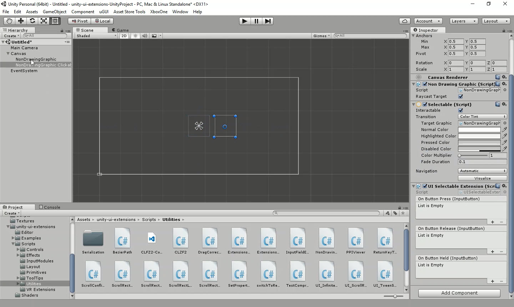

# UISelectableExtension

Refactor of original UI Button control, can now add Press/Release and Hold events to any Selectable control

<!---->

---------

## Contents

> 1 [Overview](#overview)
>
> 2 [Properties](#properties)
>
> 3 [Methods](#methods)
>
> 4 [Usage](#usage)
>
> 5 [Video Demo](#video-demo)
>
> 6 [See also](#see-also)
>
> 7 [Credits and Donation](#credits-and-donation)
>
> 8 [External links](#external-links)

---------

## Overview

The Selectable Extension adds three events to any Selectable component for Press, Release and Hold.

---------

## Properties

The properties of the Box Slider control are as follows:

Property | Description
|-|-|
*On Button Press* (event) |The Event fired when the selectable is clicked
*On Button Release* (event) |The Event fired when the selectable is released from a click
*On Button Held* (event) |The Event fired when the selectable is being held (mouse / touch down)

---------

## Usage

Simply add the default Selectable Extension to a Rect Transform using "*UI / Extensions / UI Selectable Extension*" in the "*Component*" menu.

It is also available as a Game Component menu in "*UI / Extensions / UI Selectable Extension*".

---------

## Video Demo

*Click to play*

> Shows adding the Selectable Extension to a Non Drawing Graphic GameObject

---------

## See also

* [Non Drawing Graphic](/Controls.md/NonDrawingGraphic)

---------

## Credits and Donation

* Credit [AriathTheWise]()
* Credit [Sfyne]()

---------

## External links

Sourced from - [http://forum.unity3d.com/threads/scripts-useful-4-6-scripts-collection.264161/page-2#post-1796783](http://forum.unity3d.com/threads/scripts-useful-4-6-scripts-collection.264161/page-2#post-1796783)
