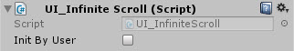

# UI_InfiniteScroll

Loops Scroll Rect content indefinitely
Configures automatically - works in both vertical and horizontal (but not both at the same time) - drag and drop  - can be initialized by code

<!---->

---------

## Contents

> 1 [Overview](#overview)
>
> 2 [Properties](#properties)
>
> 3 [Methods](#methods)
>
> 4 [Usage](#usage)
>
> 5 [Video Demo](#video-demo)
>
> 6 [See also](#see-also)
>
> 7 [Credits and Donation](#credits-and-donation)
>
> 8 [External links](#external-links)

---------

## Overview

The Infinite Scroll Rect script causes content items for a Scroll Rect to loop indefinitely as the user scrolls.

It also allows you determine whether the control starts on awake or via code.

---------

## Properties

The properties of the Scroll Rect Infinite component are as follows:

Property | Description
|-|-|
*Init By User*|Should this activate automatically or only on request.

---------

## Methods

Method | Arguments | Description
|-|-|-|
*SetNewItems*|newItems (List of Transform Items)|Appends a list of items to the Infinite Scroll child list

---------

## Usage

> Requires a configured ScrollRect.  Which will be added by  default.

Simply add the default Scroll Rect Infinite component to a Scroll Rect using "*UI / Extensions / UI Infinite Scroll*" in the "*Component*" menu.

---------

## Video Demo

*Click to play*

---------

## See also

* [Magnetic infinite Scroll](/Controls.md/UI_MagneticInfiniteScroll)
* [Scroll Rect Occlusion](/Controls.md/UI_ScrollRectOcclusion)
* [Scroll Rect Tweener](/Controls.md/ScrollRectTweener)
* [Scroll Rect Linker](/Controls.md/ScrollRectLinker)
* [Scroll Rect Conflict Manager](/Controls.md/ScrollConflictManager)

---------

## Credits and Donation

Credit [Tomasz Schelenz](https://bitbucket.org/TomekSzelki/)

---------

## External links

Sourced from - [https://bitbucket.org/UnityUIExtensions/unity-ui-extensions/issues/81/infinite-scrollrect](https://bitbucket.org/UnityUIExtensions/unity-ui-extensions/issues/81/infinite-scrollrect)
