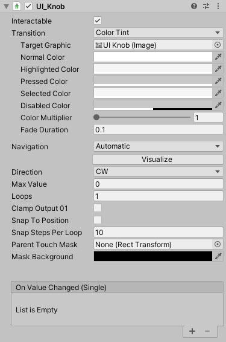

# UI_Knob

A simple knob radial control which operates like any other Knob you might find on a stereo or dial.

<!---->

---------

## Contents

> 1 [Overview](#overview)
>
> 2 [Properties](#properties)
>
> 3 [Methods](#methods)
>
> 4 [Usage](#usage)
>
> 5 [Video Demo](#video-demo)
>
> 6 [See also](#see-also)
>
> 7 [Credits and Donation](#credits-and-donation)
>
> 8 [External links](#external-links)

---------

## Overview

A powerful Knob style control, complete with a multitude of options, such as:

* Max range
* Stepped movement
* Position snapping or free movement
* Moves Clockwise or Counter Clockwise
* Controlled through mouse or touch
* Supports multiple rotations to complete range (how many rotations make the max value)

---------

## Properties

The properties of the Scroll Rect Infinite component are as follows:

Property | Description
-|-
*Direction*|Direction of rotation CW - clockwise, CCW - counterClockwise.
*Max Value*|Max value of the knob, maximum RAW output value knob can reach, overrides snap step, IF set to 0 or higher than loops, max value will be set by loops.
*Loops*|SHow many rotations knob can do, if higher than max value, the latter will limit max value.
*Clamp Output 01*|Clamp output value between 0 and 1, useful with loops > 1.
*Snap To Position*|snap to position?.
*Snap Steps Per Loop*|Number of positions to snap.
*Parent Touch Mask*|Parent touch area to extend the touch radius.
*Mask Background*|Default background color of the touch mask. Defaults as transparent.
***On Value Changed*** (event) |Event that is called every frame while rotating knob, sends a float argument of knobValue

### Inherited from Selectable

* Interactable
* Transition
* Navigation

---------

## Methods

Method | Arguments | Description
-|-|-
*SetKnobValue*|Angle (between 0 & 1), Loop number|Rotates the Knob control to the selected value and loop

---------

## Usage

To use, simply add to the scene through:

"*GameObject -> UI -> Extensions -> Controls -> UI Knob*"

Alternatively, add the component to an existing GameObject using:

"*Add Component -> UI -> Extensions -> UI_Knob*"

Then apply any images / backgrounds or highlights you need for effect.

There is also a Unity event for when the value changes that you can hook your scripts in to.  See the  [Demo Video](#video-demo) for more details.

---------

## Video Demo

---------

## See also

N/A

---------

## Credits and Donation

Tomasz Schelenz

---------

## External links

[Script source](https://bitbucket.org/UnityUIExtensions/unity-ui-extensions/issues/46/feature-uiknob#comment-29243988)
