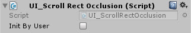

# UI_ScrollRectOcclusion

Disables the objects outside of the scrollrect viewport. Useful for scrolls with lots of content

<!---->

---------

## Contents

> 1 [Overview](#overview)
>
> 2 [Properties](#properties)
>
> 3 [Methods](#methods)
>
> 4 [Usage](#usage)
>
> 5 [Video Demo](#video-demo)
>
> 6 [See also](#see-also)
>
> 7 [Credits and Donation](#credits-and-donation)
>
> 8 [External links](#external-links)

---------

## Overview

The Scroll Rect occlusion script enables and disables Content child items that are outside the visible area of the Scroll Rect.

It allows you determine whether it starts on awake or via code.

---------

## Properties

The properties of the Scroll Rect Occlusion component are as follows:

Property | Description
|-|-|
*Init By User*|Should this occlude automatically or only on request.

---------

## Usage

Simply add the default Scroll Rect Occlusion component to a Scroll Rect using "*UI / Extensions / UI ScrollRect Occlusion*" in the "*Component*" menu.

It is also available as a Game Component menu in "*UI / Extensions / UI ScrollRect Occlusion*".

---------

## Video Demo

*Click to play*

---------

## See also

* [Scroll Rect Infinite](/Controls.md/UI_InfiniteScroll)
* [Scroll Rect Tweener](/Controls.md/ScrollRectTweener)
* [Scroll Rect Linker](/Controls.md/ScrollRectLinker)
* [Scroll Rect Conflict Manager](/Controls.md/ScrollConflictManager)

---------

## Credits and Donation

Credit [Tomasz Schelenz](https://bitbucket.org/TomekSzelki/)

---------

## External links

Sourced from - [https://bitbucket.org/UnityUIExtensions/unity-ui-extensions/issues/82/scrollrectocclusion](https://bitbucket.org/UnityUIExtensions/unity-ui-extensions/issues/82/scrollrectocclusion)
