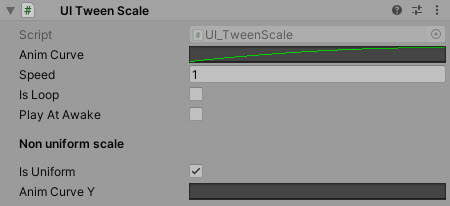
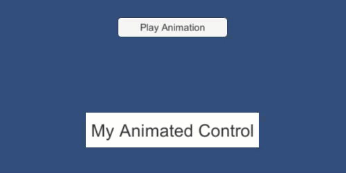

# UI_TweenScale

Dynamic scaling of text or image (including button) based on curves

<!---->

---------

## Contents

> 1 [Overview](#overview)
>
> 2 [Properties](#properties)
>
> 3 [Methods](#methods)
>
> 4 [Usage](#usage)
>
> 5 [Video Demo](#video-demo)
>
> 6 [See also](#see-also)
>
> 7 [Credits and Donation](#credits-and-donation)
>
> 8 [External links](#external-links)

---------

## Overview

A simplified control for adding programmatic scaling animation to any UI component, including buttons.

> Notes
>
> - If you want to stop the animation call the ResetTween() method.
> - In some cases it can create spikes due to redrawing on change, it is recommended  to use it on simple objects in separated canvases to avoid redrawing full canvas.
> - If you want to scale object only in 1 axis select non uniform and use linear curve from 1 to 1 to lock the scale.

---------

## Properties

The properties of the UI TweenScale control are as follows:

Property | Description
-|-
*AnimCurve*|Animation curve for scale (if isUniform set to false, will apply only to X scale)
*Speed*|Animation speed
*IsLoop*|Animation will play infinitely (in order to make it work set your animation curve to loop)
*PlayAtAwake*|Starts automatically with script becoming active. Otherwise you need to call Play() method.
*IsUniform*|If false animCurve will modify object X scale and animCurveY - Y scale.
*AnimCurveY*|Y Animation curve for non-uniform scale

---------

## Methods

Method | Arguments | Description
-|-|-
*Play*|N/A|Start the animation
*ResetTween*|N/A|Stop and reset the animation

---------

## Usage

Simply add the component to an existing RectTransform and configure the desired animation style.  Then call the "Play" method in code or via a Unity UI Event (such as a button OnClick method)

"Add Component -> UI -> Extensions -> UI Tween Scale"

---------

## Video Demo

---------

## See also

N/A

---------

## Credits and Donation

* Tomasz Schelenz

---------

## External links

[Sourced From](https://bitbucket.org/SimonDarksideJ/unity-ui-extensions/issues/83/ui_tweenscale)
