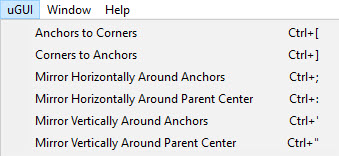

# uGUITools

A collection of functions to assist with managing anchors on RectTransforms

<!---->

---------

## Contents

> 1 [Overview](#overview)
>
> 2 [Properties](#properties)
>
> 3 [Methods](#methods)
>
> 4 [Usage](#usage)
>
> 5 [Video Demo](#video-demo)
>
> 6 [See also](#see-also)
>
> 7 [Credits and Donation](#credits-and-donation)
>
> 8 [External links](#external-links)

---------

## Overview

A useful set of tools to manipulate RectTransforms to its Anchors, or Adjusts the Anchors to the selected RectTransform.

---------

## Properties

These are editor menu utilities and expose no inspector properties.

---------

## Methods

Method | Arguments | Description
-|-|-
*Anchors to Corners*|Selected RectTransform|Moves anchors to the corners of the rect.
*Corners to Anchors*|Selected RectTransform|Moves corners of the rect to the anchor positions.
*Mirror Horizontally around Anchors*|Selected RectTransform|Flips anchors horizontally on the rect.
*Mirror Horizontally around Parent Center*|Selected RectTransform|Flips anchors horizontally relative to parent center.
*Mirror Vertically around Anchors*|Selected RectTransform|Flips anchors vertically on the rect.
*Mirror Vertically around Parent Center*|Selected RectTransform|Flips anchors vertically relative to parent center.

---------

## Usage

Simply select a RectTransform in the Scene or Hierarchy views and use the menu options to affect the RectTransforms anchors:

* Anchors to Corners - Moves the Anchors to the corners of the RectTransform
* Corners to Anchors - Moves the corners of the RectTransform to the Anchor positions
* Mirror Horizontally around Anchors - Flips the Anchors horizontally on this RectTransform (reverses content)
* Mirror Horizontally around Parent Center - Flips the Anchors horizontally based on the parent RectTransform
* Mirror Vertically around Anchors - Flips the Anchors vertically on this RectTransform (reverses content)
* Mirror Vertically around Parent Center - Flips the Anchors vertically based on the parent RectTransform

---------

## Video Demo

N/A

---------

## See also

N/A

---------

## Credits and Donation

* Senshi

---------

## External links

"List of links for the control, e.g. Source, other info"

[Sourced From](https://forum.unity.com/threads/scripts-useful-4-6-scripts-collection.264161/)
