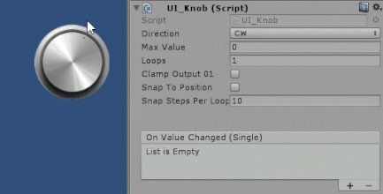
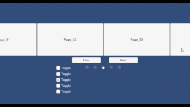

# Unity-UI-Extensions - Home

## Welcome

Welcome to the Unity UI Extensions Wiki page.  This site documents all the current controls provided by the Unity UI Extensions project, their use and tips and tricks

If you have a suggestion to update these docs? Then either submit a PR yourself, or log an issue / proposal in the [issues](https://github.com/Unity-UI-Extensions/com.unity.uiextensions/issues) section.

-----

You can follow the UI Extensions team for updates and news on:

## [Twitter - #unityuiextensions](https://twitter.com/search?q=%23unityuiextensions) / [Facebook](https://www.facebook.com/UnityUIExtensions/) / [YouTube](https://www.youtube.com/@UnityUIExtensions)

Chat live with the [Unity UI Extensions community on Gitter](https://gitter.im/Unity-UI-Extensions/Lobby) here:

[](https://gitter.im/Unity-UI-Extensions/Lobby)

> Considering migrating chat to either Discord or the [GitHub Discussions panel](https://github.com/Unity-UI-Extensions/com.unity.uiextensions/discussions/419)

-----

## [Intro](GettingStarted.md)

For more info, here's a little introduction video for the project:

> Seriously needs refreshing for the new world order 🤣

[](http://www.youtube.com/watch?v=njoIeE4akq0 "Unity UI Extensions intro video")

-----

## Release 2019.5 - (v2.2.7)  - Accelerated Deployment <- current release>

> New 2.3 release coming very soon for 2023...

We have expanded where you can download the UnityPackage asset and widened the options to contribute to the project.

[Unity 2019 or higher](UPMInstallation.md)
The recommended way to add the Unity UI Extensions project to your solution is to use the Unity package Manager. Simply use the [Unity Package Manager](UPMInstallation) to reference the project and install it.

> I will still stress however, ***contribution is optional***. **The assets / code will always remain FREE**

### Asset package downloads (and contribution links)

| [](https://unityuiextensions.itch.io/uiextensions2-0 "Download from Itch.IO") | [](https://unionassets.com/unity-ui-extensions "Download from Union Assets") | [](https://www.patreon.com/UnityUIExtensions "Support Unity UI Extensions on Patreon & download")|
| :--- | :--- | :--- |
| [Grab from Itchio](https://unityuiextensions.itch.io/uiextensions2-0) | [Obtain via Union Assets](https://unionassets.com/unity-ui-extensions) |[Support through Patreon](https://www.patreon.com/UnityUIExtensions) |

For direct access to the assets and view all previous releases, visit the [release archive](Downloads)

-----

## [Installation Instructions](UPMInstallation.md)

New for 2020, we have added OpenUPM support and the package can be installed using the following [OpenUPM CLI](https://openupm.com/docs/) command:

```cli
`openupm add com.unity.uiextensions`
```
> For more details on using [OpenUPM CLI, check the docs here](https://github.com/openupm/openupm-cli#installation).

As of Unity 2019, there are now two paths for getting access to the Unity UI Extensions project:

- [Unity 2019 or higher](UPMInstallation.md)
The recommended way to add the Unity UI Extensions project to your solution is to use the Unity package Manager. Simply use the [Unity Package Manager](UPMInstallation) to reference the project and install it.

Alternatively, you can also use the [pre-compiled Unity packages](Downloads.md) if you wish, however, UPM offers full versioning support to allow you to switch versions as you wish.

- [Unity 2018 or lower](Downloads.md)
The [pre-compiled Unity assets](Downloads.md) are the only solution for Unity 2018 or earlier due to the changes in the Unity UI framework in Unity made for 2019.
Either clone / download this repository to your machine and then copy the scripts in, or use the pre-packaged .UnityPackage for your version of Unity and import it as a custom package in to your project.

-----

## [Release Notes](ReleaseNotes/RELEASENOTES.md)

For the recent and full change history of the project, please review the change history in the release notes.
Good for catching up on what's new.

> [Release Notes](ReleaseNotes/RELEASENOTES.md)

-----

## [Controls and extensions listed in this project](Controls.md)

There are over 70+ extension controls / effect and other utilities in the project which are listed on the following page:

> ### [Check out the control demos on our Tumblr page](https://unityuiextensions.tumblr.com/)

| [](https://www.tumblr.com/blog/unityuiextensions "UI Line Renderer") | [](https://www.tumblr.com/blog/unityuiextensions "UI Knob")   | [](https://www.tumblr.com/blog/unityuiextensions "Scroll Snap")|
| :--- | :--- | :--- |
| [UI Line Renderer](https://www.tumblr.com/blog/unityuiextensions) | [UI Knob](https://www.tumblr.com/blog/unityuiextensions) |[Scroll Snap](https://www.tumblr.com/blog/unityuiextensions) |

## [UI Extensions controls list](Controls.md)

[Controls](Controls.md#controls)

|Accordion|ColorPicker|Selection Box|UI Flippable|ComboBox|
|-|-|-|-|-|
|AutoComplete ComboBox|DropDown List|BoundToolTip|UIWindowBase|UI Knob|
|TextPic|Input Focus|Box Slider|Cooldown Button|Segmented Control|
|Stepper|Range Slider|Radial Slider|MultiTouch Scroll Rect|MinMax SLider|

[Primitives](Controls.md#primitives)

|UILineRenderer|UILineTextureRenderer|UICircle|DiamondGraph|UICornerCut|
|-|-|-|-|-|
|UIPolygon|UISquircle||||

[Layouts](Controls.md#layouts)

|Horizontal Scroll Snap|Vertical Scroll Snap|Flow Layout Group|Radial Layout|Tile Size Fitter|
|-|-|-|-|-|
|Scroll Snap (alt implementation)|Reorderable List|UI Vertical Scroller|Curved Layout|Table Layout|
|FancyScrollView|Card UI|Scroll Position Controller (obsolete)|Content Scroll Snap Horizontal|Scroller|
|ResizePanel|RescalePanel|RescaleDragPanel|||

[Effects](Controls.md#effect-components)

|Best Fit Outline|Curved Text|Gradient|Gradient2|Letter Spacing|
|-|-|-|-|-|
|NicerOutline|RaycastMask|UIFlippable|UIImageCrop|SoftAlphaMask|
|CylinderText|UIParticleSystem|CurlyUI|Shine Effect|Shader Effects|

[Additional Components](Controls.md#additional-components)

|ReturnKeyTrigger|TabNavigation|uGUITools|ScrollRectTweener|ScrollRectLinker|
|-|-|-|-|-|
|ScrollRectEx|UI_InfiniteScroll|UI_ScrollRectOcclusion|UIScrollToSelection|UISelectableExtension|
|switchToRectTransform|ScrollConflictManager|CLFZ2 (Encryption)|DragCorrector|PPIViewer|
|UI_TweenScale|UI_MagneticInfiniteScroll|UI_ScrollRectOcclusion|NonDrawingGraphic|
|UILineConnector|
|UIHighlightable|Menu Manager|Pagination Manager|||

### More to come

-----

## [Supporting the UI Extensions project](https://www.paypal.com/cgi-bin/webscr?cmd=_s-xclick&hosted_button_id=89L8T9N6BR7LJ)

If you wish to further support the Unity UI Extensions project itself, then you can either subsidize your downloads above, or using the links below.

All funds go to support the project, no matter the amount. **Donations in code are also extremely welcome**

|[](https://www.paypal.com/cgi-bin/webscr?cmd=_s-xclick&hosted_button_id=89L8T9N6BR7LJ "Donating via Paypal")|[](https://ko-fi.com/uiextensions "Buy us a Coffee")|
|-|-|
|||

> (PayPal account not required and you can remain anonymous if you wish)

-----

## More Information

For more information about the project, please see the following pages:

- [Downloads](Downloads.md)
- [Getting Started](GettingStarted.md)
- [UPM Installation Instructions](UPMInstallation.md)
- [Controls detailed list](Controls.md)
- [Further Information](FurtherInfo.md)
- [Contribution Guidelines](ContributionGuidelines.md)
- [See who's contributing](Contributors.md)
- [About](About.md)